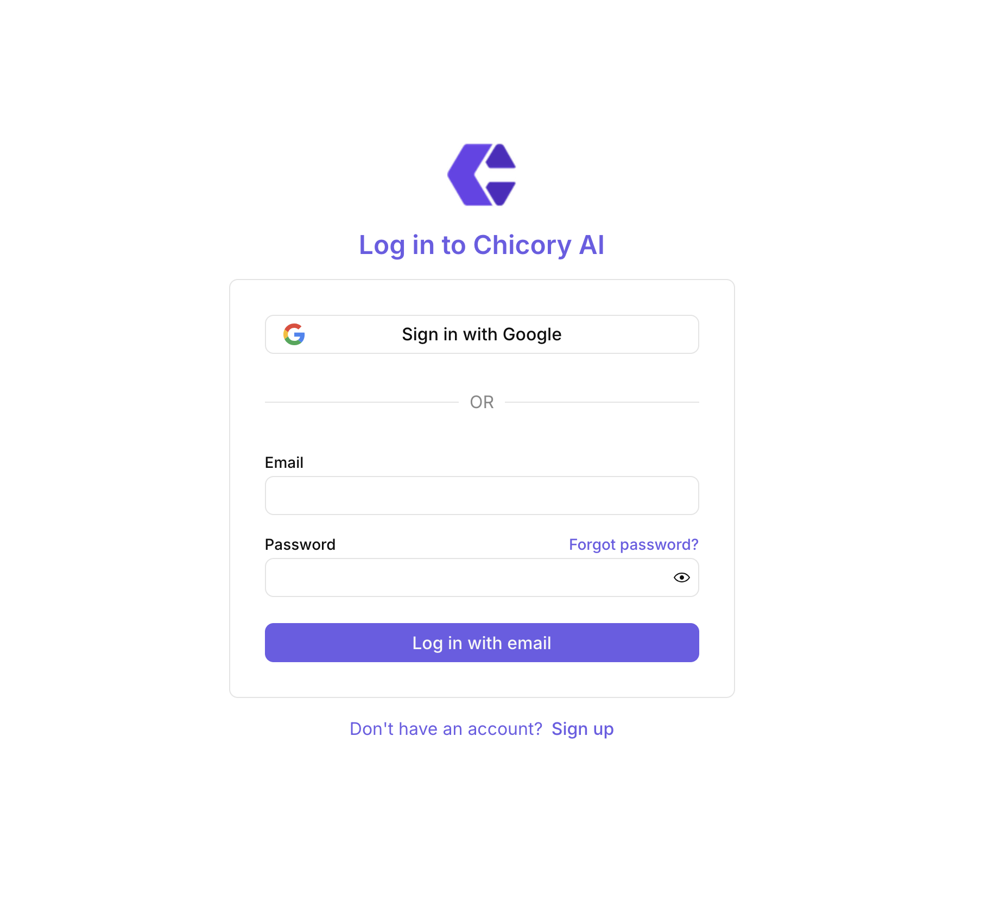
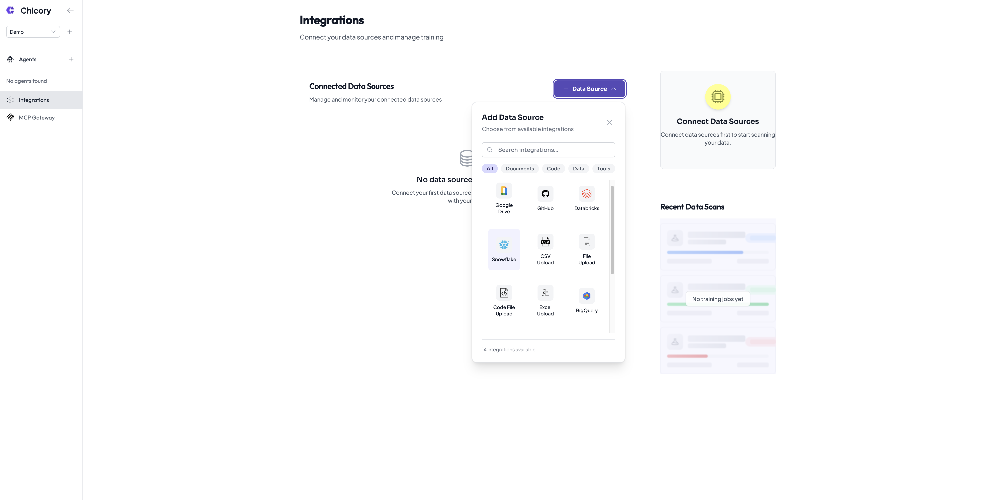
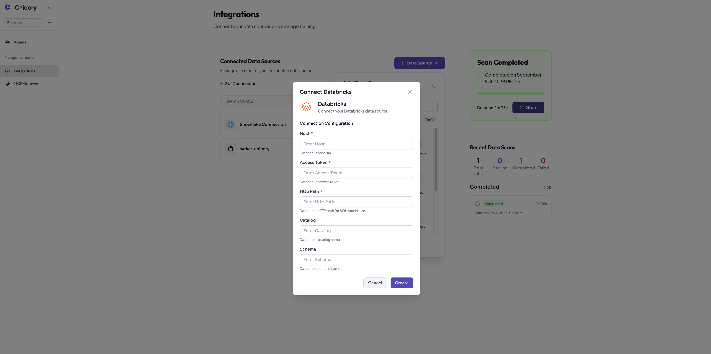
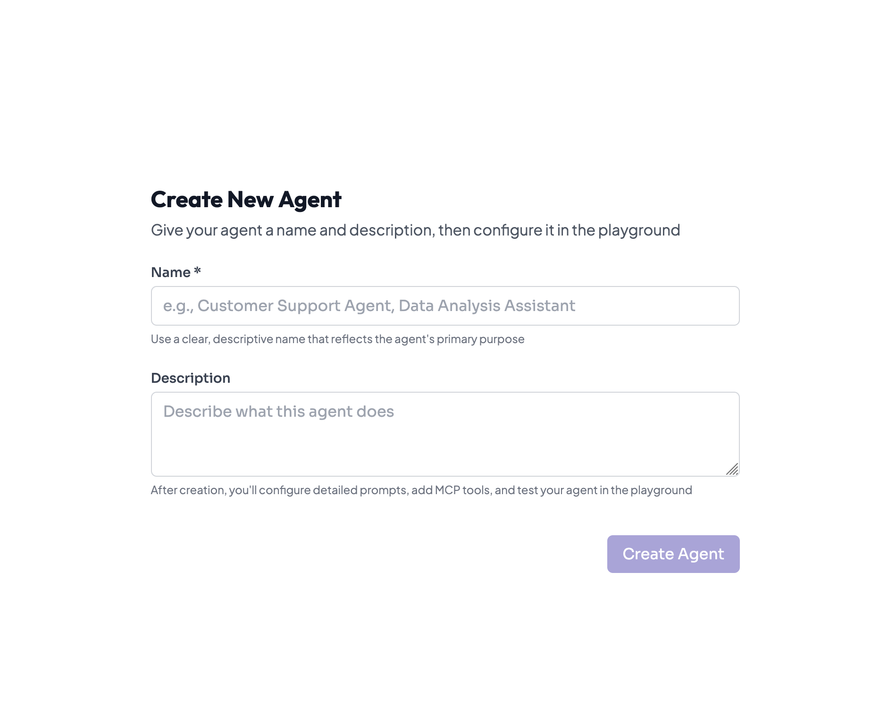
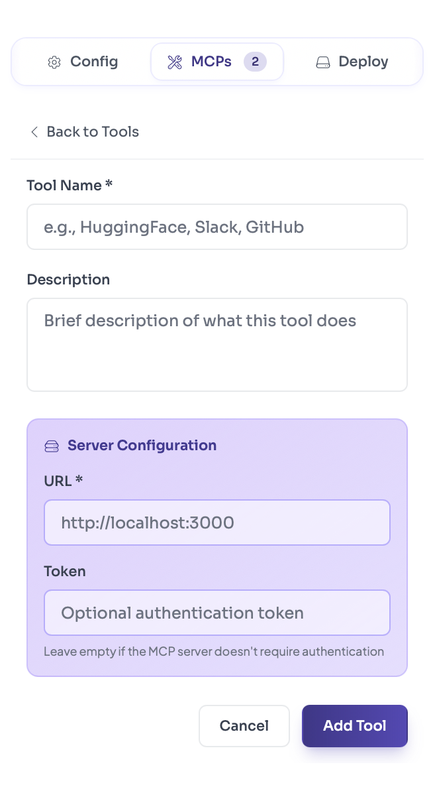
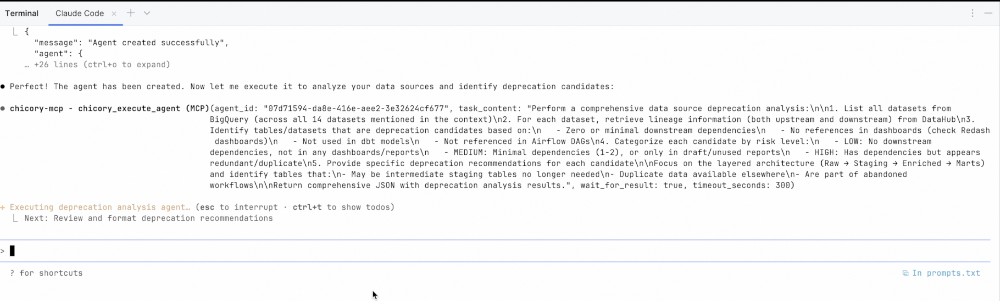
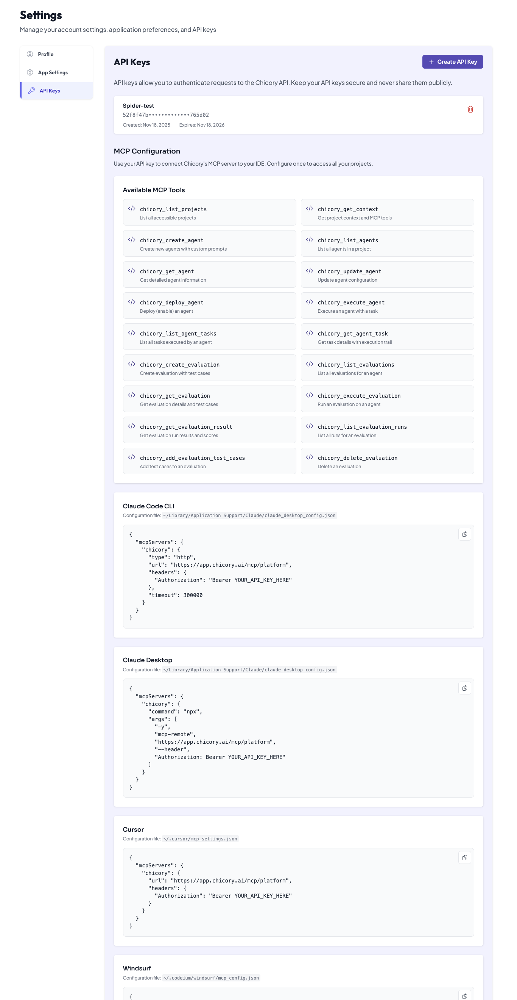

# Creating a Chicory Agent

This guide walks you through the complete process of creating your first Chicory AI agent, from initial setup to testing and refinement.

Chicory offers **two powerful approaches** to build your agents:

- **Part 1: Platform Approach** - Use the visual dashboard to create and configure agents through our intuitive web interface
- **Part 2: MCP Tools Approach** - Build agents conversationally using natural language through Chicory's MCP tools

Choose the approach that best fits your workflow, or use both for maximum flexibility!

---

## Part 1: Platform Approach

Build your agent using Chicory's visual dashboard with step-by-step guidance.




### Sign Up & Access Your Chicory AI Workspace

* Open your browser and go to `app.chicory.ai`.
* **New users**: Click "Sign Up." You can either:
  * **Use Google SSO**: Click "Sign up with Google" for quick authentication
  * **Create manual account**: Provide your name, email and create a strong password
  * After authentication, you'll be prompted to create an organization by entering its name. This will be your workspace.
  * Once your organization is set up, you can **invite other members** for shared access to context and AI agents, promoting collaboration.
  * Complete any remaining steps to finalize your account and organization setup.
* **Existing users**: Log in with your credentials or Google SSO.

<figure><figcaption><p>Chicory Signup/Login Screen</p></figcaption></figure>





### Connect Your Assets in the "Integrations" Tab

To understand your data well, Chicory AI needs to connect to your company's various data assets. You'll manage these connections in the "**Integrations**" tab.

**How to Add an Integration:**

* **Open the Integrations Tab**
  * In the left-hand menu of the dashboard, click **Integrations**.
* **Pick Your Asset Type**
  * You'll see three sections: **Document Sources**, **Code Repositories**, **Data Sources** and **Data Tools**.
  * Click the section for the asset you want to add.
* **Select Your Connector**
  * Choose from our list (e.g., Databricks, GitHub, Google Drive, file upload).
* **Enter Connection Details & Test**
  * If there's a **Test Connection** button, click it to confirm everything works.
  * Then click **Save** or **Connect**.


**Tip for Best Results:** To get the most out of Chicory AI, help it understand your data fully by connecting:

* Your main **Data** sources (like databases or data files).
* Your **Code** (like GitHub repositories) that creates, changes or uses your data. Make sure the access token has access to the repositories you plan to train on!
* Your **Docs** (like PDFs, Word files, or items from Google Drive) that explain your data, business rules, or how things work.
* Your **Tools** (like dbt, Airflow, or other data products) that helps fetch real-time data and execute actions.

Connecting all three types of assets (Data, Code, and Docs) for the same project helps Chicory AI understand things much better.



<div align="left"><figure><figcaption></figcaption></figure></div>





### Scan Context

* **Start Scanning**
  * Once all data sources are added, find the **Scan** button on the Integrations tab and click to begin scanning.
* **What happens during scanning**
  * Chicory scans schemas, parses code, indexes docs, samples the data and links everything into a living "context".
* **Scanning Duration**
  * Training time varies based on the volume, type, and complexity of the connected assets.


**Important:** If Chicory's scanning has not completed within **1 hour**, or if processing very large assets, contact `support@chicory.ai` for immediate assistance.


  <div align="left"><figure><figcaption><p> Databricks Connector Example</p></figcaption></figure></div>





### Create and Configure Your Agent

* **Start creating an Agent:** In the main navigation panel, click the "**+ Agent**" button.
* **Define Your Agent:**
  * **Name:** Enter a clear name, e.g., "**Data Catalog Assistant**."
  * **Description:** Describe its purpose, e.g., "**Provides descriptions for tables and columns within a specified connected data source when requested by a user.**"
  * **Instructions:** Provide natural language instructions that define the agent's core capabilities and how it should respond.
    * Example:
      ```
      You are a Data Catalog Assistant.

      Your main role is to answer user questions about the details of tables and columns within this data source. This includes providing summaries of tables, listing their columns, and giving column data types and any available descriptions that Chicory AI has discovered.

      Always aim to provide clear, accurate, and helpful information.
      ```
  * **Output Format (if applicable):** While the initial interaction is chat-based, the agent should aim for structured and readable responses within the chat that can be used by future API, and Agent to Agent communications.

**Recommendation:** Use Platform's Prompt Agent to enhance your prompt/instructions. Refer: [Prompt-Builder](prompt-builder.md)

<div align="left"><figure><figcaption></figcaption></figure></div>





### [Optional] Add MCP Tool

You can enhance your agent's capabilities by adding MCP (Model Context Protocol) tools for additional functionality.

<div align="left"><figure><figcaption></figcaption></figure></div>





### Test & Refine Your Agent

* **Save your agent** by clicking "Create Agent" - your first Chicory-powered agent is now ready!
* **Test in Chat Interface:**
  * After saving your agent, use its dedicated chat interface to interactively test and refine its behavior.
  * Engage by typing natural language requests or commands that align with the instructions you set during its definition.
    * For example, if you configured the **Data Catalog Assistant**, you might ask it: `"Describe the 'customer_activity' table."` or `"What columns are in the 'product_inventory' table?"`
  * Carefully review the agent's responses to your inputs. Test its performance by asking follow-up questions, rephrasing requests, and exploring different scenarios.
  * **Refine as needed:** If adjustments are needed, click the agent's name and edit its instructions. Save changes, then return to the chat to re-test and refine.




---

## Part 2: MCP Tools Approach

Build your agent end-to-end through natural language conversation using Chicory's MCP tools.

### Overview

Chicory now provides comprehensive agent management capabilities through the Model Context Protocol (MCP). This means you can plug in the LLM interface of your choice (such as Claude Desktop, IDEs with AI assistants, or custom LLM setups) and directly access Chicory's capabilities through conversational commands.

With Chicory's MCP tools, you can:
- Create, update, and manage agents using natural language
- Access your organization's full context and integrations
- Iterate and validate agents locally before production deployment
- Execute agents and retrieve results conversationally

### Available MCP Tools

Chicory provides the following MCP tools for agent management:

- `projects` - Project Management and Access to organization's integrated data context
- `agents` - Agent Lifecycle Management
- `tasks` - Task Management
- `evaluation` - Evaluation Management

### Use Case: Multi-Tool Integration with Secure Agent Access

Consider a scenario where you need to integrate multiple tools across your data warehouse and provide secure, agent-level access to them. By exposing Chicory's Platform MCP tools to your preferred LLM, you can enable this capability seamlessly.

**The Workflow:**

1. **Local Development & Iteration** - Build and refine your agent conversationally with full tool access and context
2. **Validation** - Test thoroughly using your local or preferred LLM setup
3. **Production Deployment** - Once validated, publish the agent to Chicory for a production-ready, scalable deployment

### Example: Building an Agent Conversationally

Here's a quick example showing how you can interact with Chicory to create an agent using simple natural language:

```
You: "Create a new agent called 'SQL Query Assistant' that helps users write
     optimized SQL queries for our data warehouse"

LLM: *Uses chicory_get_context to understand your data warehouse structure*
     *Uses chicory_create_agent to create the agent*

     "I've created the 'SQL Query Assistant' agent. It has access to your
     data warehouse schema including 15 tables across your sales, inventory,
     and customer domains. Would you like me to add specific instructions
     about query optimization patterns?"

You: "Yes, make it focus on avoiding full table scans and using proper indexing"

LLM: *Uses chicory_update_agent to refine the instructions*

     "Updated! The agent now emphasizes index-aware query patterns and will
     suggest optimizations to avoid full table scans. Would you like to test
     it with a sample query?"

You: "Yes, ask it how to find the top 10 customers by revenue this month"

LLM: *Uses chicory_execute_agent to test the agent*

     "The agent provided an optimized query using the customer_id index and
     a date partition on the orders table. Here's what it suggested:

     SELECT c.customer_id, c.name, SUM(o.total_amount) as revenue
     FROM customers c
     JOIN orders o ON c.customer_id = o.customer_id
     WHERE o.order_date >= DATE_TRUNC('month', CURRENT_DATE)
     GROUP BY c.customer_id, c.name
     ORDER BY revenue DESC
     LIMIT 10;

     It also noted that this query leverages the existing indexes on
     customer_id and the partition on order_date. Ready to publish to production?"
```

<figure><figcaption><p>Chicory Platform MCP Use</p></figcaption></figure>

### Getting Started with MCP Tools




#### Prerequisites

Before using Chicory's MCP tools, ensure you have:

1. **Chicory Account** - Active account with your organization set up
2. **API Token** - Generated from the Chicory platform (Profile → API Tokens)
3. **MCP-Compatible Interface** - Claude Desktop, compatible IDE, or custom LLM setup
4. **MCP Server Configuration** - Chicory's MCP server installed and configured with your API token





#### Connect Chicory MCP Tools

1. **Install the Chicory MCP Server** (if not already installed)
   - Follow the installation instructions in the [MCP Integration Guide](../../integrations/mcp/)

2. **Configure Authentication**
   - Add your Chicory API token to the MCP server configuration
   - Verify connection by listing your agents: `chicory_list_agents`

3. **Verify Your Context**
   - Use `chicory_get_context` to ensure you have access to your organization's integrated data sources





#### Create Your Agent

Start a conversation with your LLM interface and describe the agent you want to create. The LLM will use the appropriate MCP tools to build your agent.

**Example prompts:**
- "Create an agent that helps users understand our data catalog"
- "Build a SQL assistant that can query our Snowflake data warehouse"
- "Make an agent that answers questions about our dbt models"

The LLM will automatically:
- Access your context to understand available resources
- Create the agent with appropriate instructions
- Configure integrations and capabilities





#### Iterate and Refine

Continue the conversation to refine your agent:

**Example refinement prompts:**
- "Update the agent to include examples in its responses"
- "Add instructions to format output as markdown tables"
- "Make it more concise in its explanations"

The LLM will use `chicory_update_agent` to apply your changes.





#### Test Your Agent

Validate your agent by executing queries through the conversation:

**Example test prompts:**
- "Test the agent with this question: [your test query]"
- "Execute the agent and ask it about [specific topic]"
- "Run a few sample queries to validate the responses"

The LLM will use `chicory_execute_agent` to run your tests and show you the results.





#### Deploy to Production

Once you're satisfied with your agent's performance:

1. **Verify Completeness** - Ensure all instructions and configurations are finalized
2. **Production Ready** - Your agent is automatically available through Chicory's REST API and MCP Gateway
3. **Share Access** - Configure authentication and share with your team
4. **Monitor & Improve** - Continue iterating based on usage and feedback





<figure><figcaption><p>Chicory Platform MCP Integration</p></figcaption></figure>

### Benefits of the MCP Approach

- **Natural Language Interface** - Build complex agents through simple conversation
- **Flexible Development Environment** - Use your preferred LLM and tools
- **Rapid Iteration** - Test and refine without switching contexts
- **Full Platform Access** - Complete access to your organization's data and integrations
- **Local Validation** - Thoroughly test before production deployment
- **Seamless Deployment** - Publish directly to Chicory's production infrastructure

### When to Use MCP Tools vs. Platform

**Use MCP Tools when:**
- You prefer working in your IDE or development environment
- You want to script agent creation and management
- You need rapid iteration with immediate feedback
- You're building multiple similar agents
- You want to integrate agent management into existing workflows

**Use the Platform when:**
- You prefer visual interfaces
- You're new to Chicory and want guided setup
- You need to share agent configuration with non-technical stakeholders
- You want to use the integrated chat interface for testing

Both approaches provide full access to Chicory's capabilities - choose based on your preferred workflow!

---
