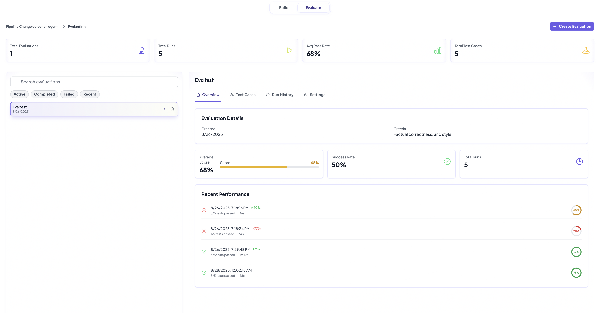

# Evaluation / Evolving the Agent

---

## Overview

Agent development doesn’t end after the first working version. To ensure reliability, performance, and accuracy, **Chicory AI** provides an evaluation framework where you can bring your own validation dataset, define checks, and evolve your agent through iterative testing.  

This forms the **Agent Development Life Cycle (ADLC):**
1. Build → 2. Evaluate → 3. Evolve → 4. Deploy → 5. Monitor

---

## Dataset Format

When you upload a validation dataset on the Chicory platform, it follows a structured format (downloadable in the platform UI):

- **Input**: Example prompts, PR diffs, pipeline queries, or tasks you expect the agent to handle.  
- **Expected Output**: Ground truth answer, SQL snippet, or feedback the agent should produce.  
- **Evaluation Guideline**: Tags like difficulty, domain, or test category.


<div align="left"><figure><figcaption></figcaption></figure></div>

---




## Define Evaluation Criteria

Before running tests, think through *what matters most* for your use case:

- **Accuracy** – Does the output match the ground truth?
- **Completeness** – Did the agent address all parts of the task?
- **Efficiency** – Was the SQL or code optimized?
- **Clarity** – Is the explanation useful to the user?
- **Reliability** – Does the agent behave consistently across runs?

Chicory recommends starting small (accuracy + efficiency), then layering in more criteria as the agent matures.





## Run Evaluation

- Upload or select your validation dataset.
- Choose the agent you want to test.
- Select evaluation criteria.
- Run the evaluation.

Chicory will score each input/output pair and generate a detailed report.

<div align="left"><figure><figcaption></figcaption></figure></div>

Example:
```csv
task,expected_output,evaluation_guideline
"What is the capital of France?","Paris","The response should correctly identify Paris as the capital of France"
"Explain photosynthesis in simple terms","Photosynthesis is the process by which plants use sunlight, water, and carbon dioxide to create oxygen and energy in the form of sugar","The response should explain that plants convert sunlight, water, and CO2 into oxygen and sugar/energy"
"Write a haiku about winter","A haiku with 5-7-5 syllable structure about winter themes","The response should follow the 5-7-5 syllable pattern and include winter imagery"
"Calculate 15% tip on $45.80","$6.87","The response should correctly calculate 15% of $45.80 which equals $6.87"
"List three benefits of regular exercise","1. Improves cardiovascular health 2. Helps maintain healthy weight 3. Boosts mood and mental health","The response should list at least three legitimate health benefits of exercise"
```





## Analyze Results

The evaluation output includes:
- Scores by criterion (accuracy %, efficiency rating, etc.)
- Detailed grader feedback for each test case
- Aggregate metrics for quick comparison between agent versions





## Evolve the Agent

Based on results, you can:
- Tune prompts to improve accuracy
- Add rules or guardrails for reliability
- Refactor code/output templates for efficiency
- Re-train on weak spots using examples from failed cases

After each adjustment, rerun the evaluation to confirm improvements. Over multiple iterations, this process evolves your agent to production-ready quality.





## Promotion to Deployment

When the agent consistently meets your benchmarks:
- Promote the agent to deployment using REST API or MCP Gateway




---

## Key Takeaways

- Validation datasets + LLM Graders create a feedback loop.
- Evaluation helps you quantify quality, not just eyeball outputs.
- Iterative cycles = evolve before you deploy.
- Once satisfied, the agent can move confidently into production usage.

---
