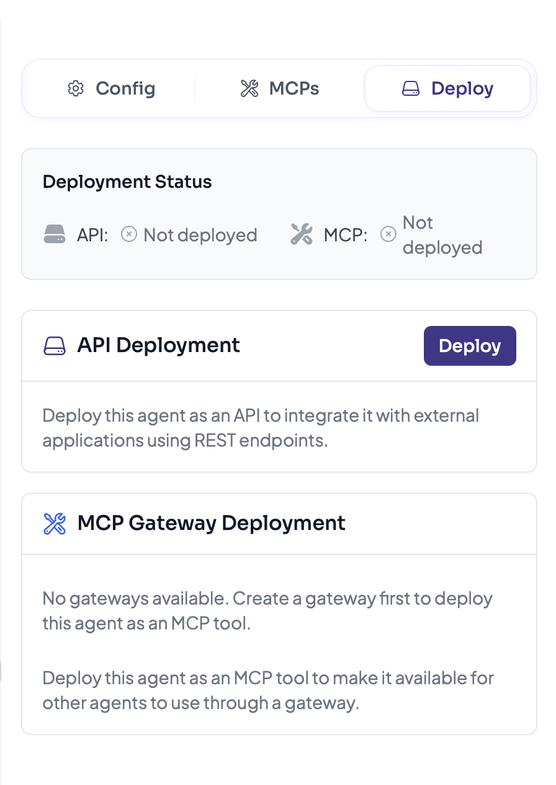
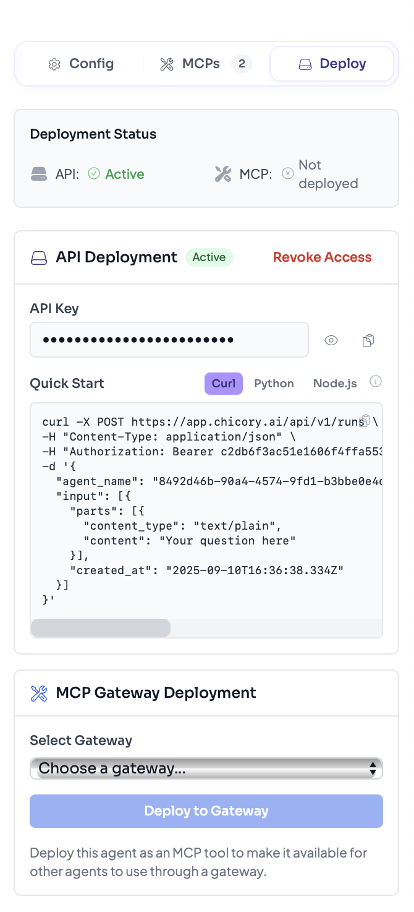
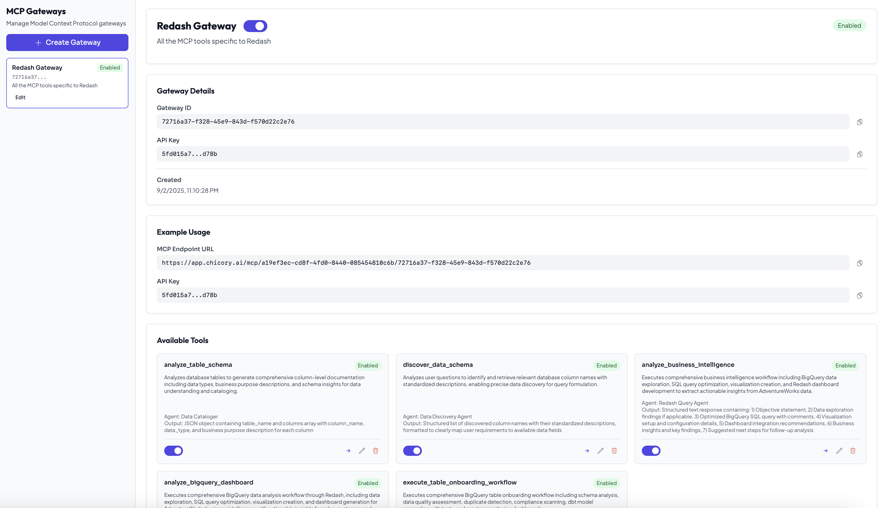
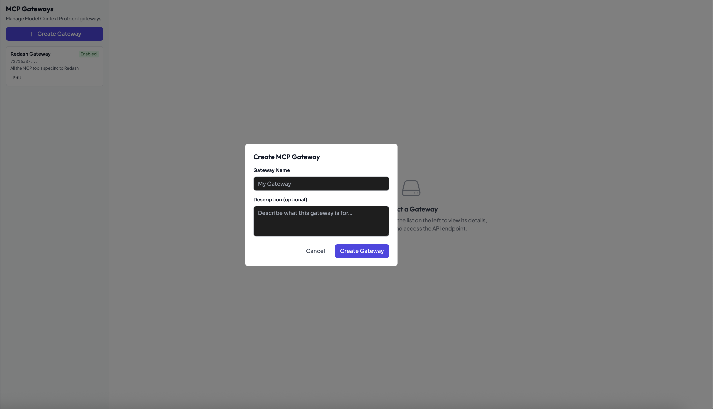
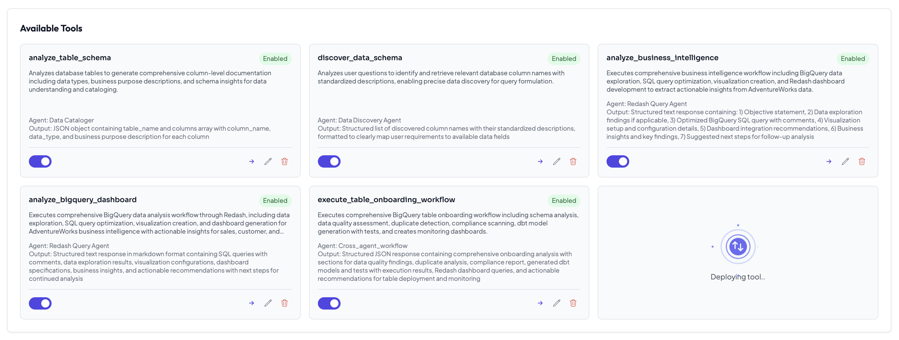

# Deploying the Agent

Chicory agents can be deployed through two main methods: **REST API** for direct API access and **MCP Gateway** for integration with MCP-compatible systems.
(A2A coming soon)

<div align="left"><figure><figcaption></figcaption></figure></div>

## Option 1: Deploy as REST API

This method provides direct API access to your agent for integration with applications and services.

### Steps for REST API Deployment

1. **Access Agent Configuration**
   * Click the Agent's Name at the top of the chat interface
   * Click "Edit" to open the agent's configuration

2. **Deploy the Agent**
   * Navigate to the section labeled "Deployed API"
   * Click "Deploy Agent"

3. **Get Deployment Details**
   * After deployment, you'll see the API endpoint, authentication details, and version info
   * Generate an API token from Chicory platform
   * Store it in your target repo secrets as `CHICORY_API_TOKEN`
   * Similarly, store your agent ID as `CHICORY_AGENT_ID`

<div align="left"><figure><figcaption></figcaption></figure></div>

### Using the REST API

Once deployed, you can interact with your agent via HTTP requests:

```bash
   curl -X POST https://app.chicory.ai/api/v1/runs \
   -H "Content-Type: application/json" \
   -H "Authorization: Bearer ${CHICORY_API_TOKEN}" \
   -d '{
   "agent_name": "${AGENT_ID}",
   "input": [{
      "parts": [{
         "content_type": "text/plain",
         "content": "Your question here"
      }],
      "created_at": "2025-09-10T16:38:27.056Z"
   }]
   }'
```

## Option 2: Deploy as MCP Gateway

MCP Gateways enable you to create a group of agents and execute complex agent workflows. Each agent is deployed to an MCP gateway in an agentic process, allowing for orchestrated multi-agent interactions and collaborative task execution. [Refer Documentation](https://modelcontextprotocol.io).

<div align="left"><figure><figcaption></figcaption></figure></div>

### Steps for MCP Gateway Creation

1. **Create MCP Gateway**
   * Navigate to the MCP Gateway section in your dashboard
   * Click "Create New MCP Gateway"
   * **Name**: Enter a descriptive name for your gateway (e.g., "Data Analysis Workflow")
   * **Description**: Describe the purpose and workflow of your agent group (e.g., "Orchestrates data extraction, analysis, and reporting agents")

   <div align="left"><figure><figcaption></figcaption></figure></div>

2. **Deploy Agents to MCP Gateway**
   * Select the agents you want to include in the workflow as a tool
   * For each tool, valdiate/configure the description

   <div align="left"><figure><figcaption></figcaption></figure></div>

### MCP Gateway Benefits

* **Multi-Agent Orchestration**: Coordinate multiple specialized tools (agents) in complex workflows
* **Agentic Process Execution**: Enable agents to work together autonomously on multi-step tasks
* **Scalable Architecture**: Handle complex tasks by distributing work across specialized agents
* **Process Standardization**: Create reusable agent workflows for common business processes

## Deployment Best Practices

* **Security**: Always use secure token storage and rotation practices
* **Monitoring**: Set up monitoring for both API and MCP deployments
* **Testing**: Thoroughly test deployments in staging before production
* **Documentation**: Document your API endpoints and MCP configurations for your team

## Next Steps

After deployment, consider:
* Setting up monitoring and logging
* Implementing rate limiting and security measures
* Creating documentation for API consumers
* Planning for scaling and load balancing

---
