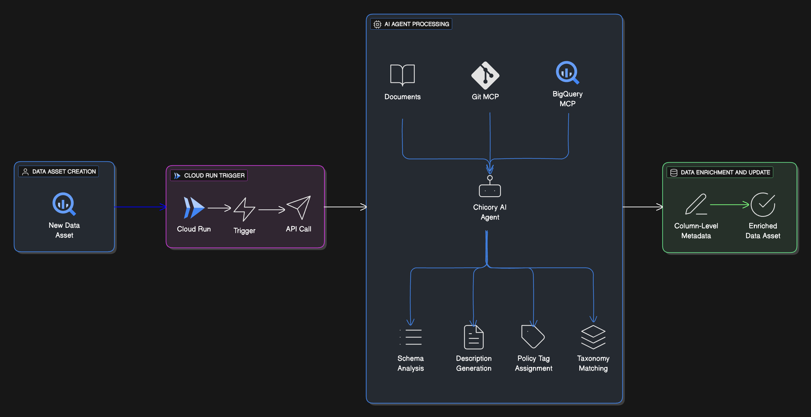

# Pipeline Performance & Efficiency Analysis Cookbook

This cookbook demonstrates how to integrate **Chicory AI** with your data stack to extract the column level metadata based on the schema requested. The agent is triggered on new data asset creation via the cloud run function in Bigquery, this could be integrated with any data warehouse scheduled job runs. 

---

## What You’ll Build

A Cloud Run function that: 
- Gets triggered when a new table is detected
- Pushes the new table schema to the agent 
- Polls for the response from the agent
- Extracts the column description and policy_tags from the agent output
- Pushes the metadata catalog back to Bigquery

A Scheduler job that: 
- Can be triggered on a schedule when a new table is onboarded

An agent that:
- Scans the schema and analyzes patterns by referring to the sample data
- Refers to supporting documentation/code
- Suggests rich columns descriptions
- Gives the output in a json format

---

## Contents

- [Introduction](docs/introduction.md) – Introduction to setup and tools
- [Agent Monitoring Table](docs/agent-monitoring-table.md) - Create new data asset monitoring table
- [Build Taxonomy Policies](docs/build-taxonomy-policies.md) - Build/retrieve the data governance rules
- [Agent Creation](docs/chicory-agent.md) – Creating a Chicory Agent
- [Trigger Agent](docs/trigger-agent.md) - Trigger the agent via cloud run
- [Sample Catalog](docs/sample-catalog.md) – Example catalog output from the agent
- [Troubleshooting](docs/troubleshooting.md) – Common issues & fixes

---
