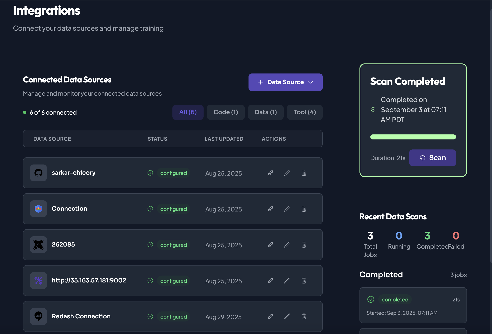

# Creating a Chicory Agent




## Create or join Organization/Project. Configure integrations:
   - BigQuery
   - Any Additional supporting documentation/code files
   - Taxonomies created for policy tag update 






## Create New Agent.

Refer: [Agent Development Life Cycle](../../../../getting-started/building-your-first-agent/docs/1-agent-creation.md)

Recommend Prompt:
```

Agent Name : Data Catalog Agent

Agent Description: Description of the Agent Task (Optional)

Agent Prompt : 

Analyze the table and provide column level descriptions with data governance policies.

**Steps:**
1. First, refer to the complete-taxonomies json file to understand available policy tags
2. Get the table schema and sample a few rows  
3. For each column, match against the taxonomy using column name patterns and data types
4. Describe each column's purpose, data type, and assign appropriate policies based on the taxonomy
5. **IMPORTANT**: Use the full policy tag resource name from the taxonomy file, not just the display name

**CRITICAL JSON FORMATTING:**
- Use standard JSON format with double quotes only
- Field names must be clean: table_name, column_name, data_type, description, policy_tag, policy_tag_display_name, classification_reasoning

**Return this exact JSON format (NO BACKTICKS):**
{
  "table_name": "chicory-mds.raw_adventureworks.financial_transactions",
  "columns": [
    {
      "column_name": "exact_column_name",
      "data_type": "STRING",
      "description": "What this column contains and its business purpose",
      "policy_tag": "projects/chicory-mds/locations/us/taxonomies/5701262395035189064/policyTags/XXXXXXXXXXXXXXXX",
      "policy_tag_display_name": "PII_DIRECT",
      "classification_reasoning": "Why this policy was chosen based on column name and type"
    }
  ]
}

**Policy Tag Selection Instructions:**
- Match column names and data types against the taxonomy policy tags
- Use the full resource name from the "name" field in the taxonomy
- Choose the most appropriate sensitivity level:
  - **HIGH_SENSITIVITY**: PII_DIRECT, PII_BIRTH_DATA - for highly sensitive personal data
  - **MEDIUM_SENSITIVITY**: CUSTOMER_PROFILE, GEOGRAPHIC_DATA - for business sensitive data
  - **LOW_SENSITIVITY**: SYSTEM_IDENTIFIERS, PUBLIC_REFERENCE - for operational data

**FINAL REQUIREMENTS:**
- Return only clean JSON with standard double quotes
- If no tags match, use: "policy_tag": "unclassified"
- Remove ALL backticks from field names and values

```




## `Save` Agent.




## [Deploy](../../../../getting-started/building-your-first-agent/docs/3-deployment.md) Agent.
- Store the API in your secrets template under config as `CHICORY_API_TOKEN`.
- Store your agent ID as `CHICORY_AGENT_ID`.



