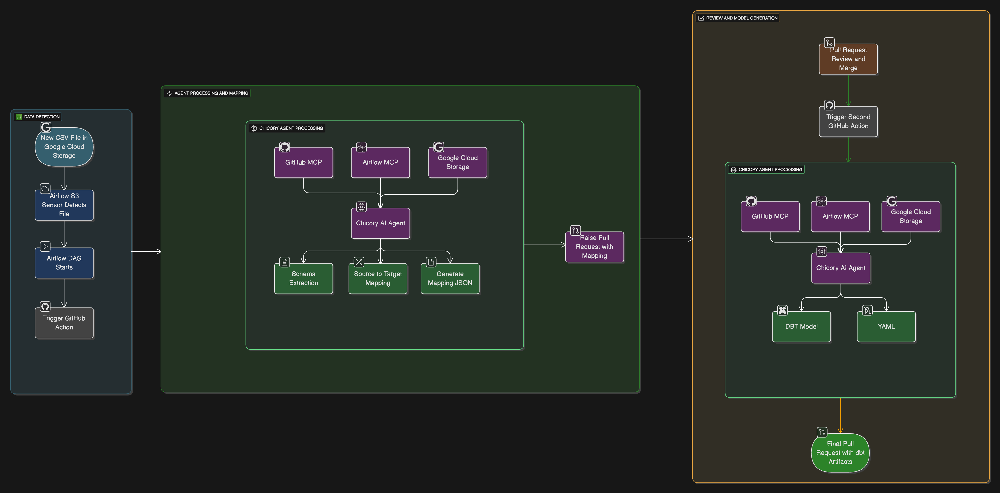

# Automated Ingestion & Schema Mapping Cookbook

This cookbook demonstrates how to integrate **Chicory AI** with your data stack to automate schema mapping and dbt model generation when new CSV files land in your data lake. The workflow combines Airflow orchestration, GitHub Actions, and Chicory agents to create a fully automated data ingestion pipeline.

---

## Quick Start

1. Set up GCS bucket monitoring with Airflow
2. Configure GitHub Actions for schema mapping
3. Deploy Chicory agent for schema transformation
4. Set up automated dbt model generation workflow
5. Test the complete pipeline with a sample CSV file

---

## Architecture Overview

The automated ingestion workflow follows these steps:
1. **New CSV lands** in S3 bucket
2. **Airflow S3 Sensor** detects file → starts DAG
3. **DAG extracts schema** → triggers GitHub Action
4. **GitHub Action + Chicory Agent** map source schema → target model, outputs mapping.json
5. **Action raises PR** with mapping
6. **Once PR is merged**, second GitHub Action calls Chicory Agent → generates dbt model + YAML docs
7. **Final PR adds dbt artifacts** → ready to run

---

## Contents

- [Introduction](docs/introduction.md) – Architecture overview and prerequisites
- [S3 Bucket Setup](docs/s3-bucket-setup.md) – Configure S3 bucket and IAM permissions
- [Airflow DAG Configuration](docs/airflow-dag-configuration.md) – Set up S3 sensor and schema extraction
- [Chicory Agent Creation](docs/chicory-agent.md) – Creating schema mapping agents
- [GitHub Actions Workflow](docs/github-actions-workflow.md) – Automated PR creation and dbt generation
- [dbt Model Generation](docs/dbt-model-generation.md) – Automated model and documentation creation
- [Testing & Validation](docs/testing-validation.md) – End-to-end pipeline testing
- [Troubleshooting](docs/troubleshooting.md) – Common issues & fixes

---