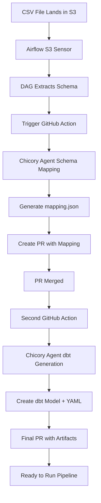

# Introduction

## Overview

The Automated Ingestion & Schema Mapping cookbook provides a complete solution for automating the data ingestion process when new CSV files arrive in your data lake. This workflow eliminates manual schema mapping and dbt model creation, reducing time-to-insight and improving data engineering productivity.

## Architecture

## Key Components

### 1. **S3 Bucket & Monitoring**
- Configured S3 bucket for CSV file drops
- IAM roles and permissions for Airflow access
- File organization and naming conventions

### 2. **Airflow Orchestration**
- S3 sensor for file detection
- Schema extraction DAG
- GitHub Actions triggering

### 3. **Chicory AI Agents**
- **Schema Mapping Agent**: Maps source CSV schema to target data model
- **dbt Generation Agent**: Creates dbt models and YAML documentation

### 4. **GitHub Actions Workflows**
- Automated PR creation for schema mappings
- dbt artifact generation and deployment
- Integration with version control

## Prerequisites

Before starting this cookbook, ensure you have:

- **AWS Account** with S3 bucket access
- **Airflow** deployment (Cloud Composer, Astronomer, or self-hosted)
- **GitHub repository** for your dbt project
- **Chicory AI** account and API access
- **dbt** project structure in place
- **Python 3.8+** for local development

## Benefits

- **Zero Manual Intervention**: Complete automation from file landing to dbt model
- **Consistent Schema Mapping**: AI-powered mapping reduces errors and improves consistency
- **Version Control Integration**: All changes tracked through GitHub PRs
- **Scalable Architecture**: Handles multiple files and schema variations
- **Audit Trail**: Complete lineage and change history
- **Fast Time-to-Value**: New data sources available within minutes

## Use Cases

This cookbook is ideal for:
- **Data Lakes** with frequent CSV ingestion
- **Multi-source Data Integration** projects
- **Agile Analytics** environments requiring fast iteration
- **Self-service Analytics** platforms
- **Compliance-heavy** industries requiring audit trails

---

Next: [S3 Bucket Setup](s3-bucket-setup.md)