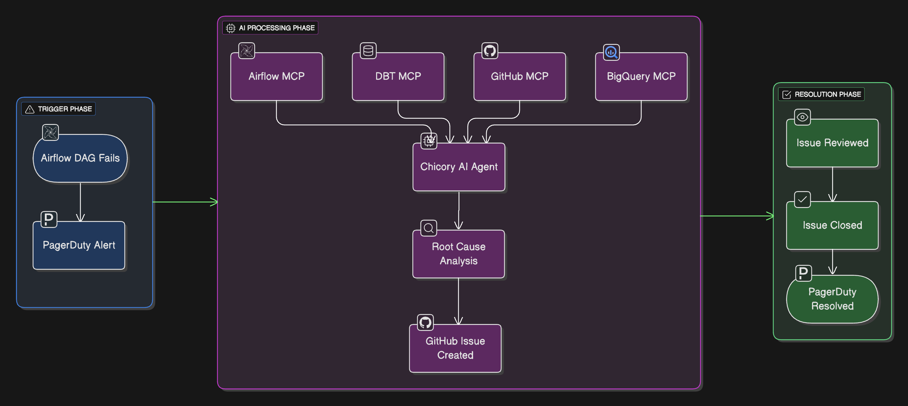

# Root Cause Analysis Cookbook

This cookbook demonstrates how to integrate **Chicory AI** with your data stack in order to perform Root Cause Analysis. The agent is triggered on an Airflow DAG pipeline failure. 

---

## What You’ll Build

An Airflow Dag that:
- Runs Data Quality Validation checks across the data source and transformed data via DBT
- Connects to Pager Duty to send incident alerts for pipeline failures
- Connects to Chicory Agent to perform Root Cause Analysis 

An agent that:
- That scans the metadata across Bigquery, DBT and Airflow via MCP
- Scans through supporting documentation and code repositories 
- Performs detailed upstream and downstream analysis 
- Generates Root Cause Analysis and suggests fix's by raising a Github Issue. 

Git Action: 
- That updates Pager Duty Incident once the Git Issue is reviewed, acknowledged and closed.

---

## Contents

- [Introduction](docs/introduction.md) – Introduction to setup and tools
- [Workflow](docs/workflow.md) - In detail workflow 
- [Agent Creation](docs/chicory-agent.md) – Creating a Chicory Agent
- [Sample Catalog](docs/sample-issue-raised.md) – Sample analysis output 
- [Troubleshooting](docs/troubleshooting.md) – Common issues & fixes

---
