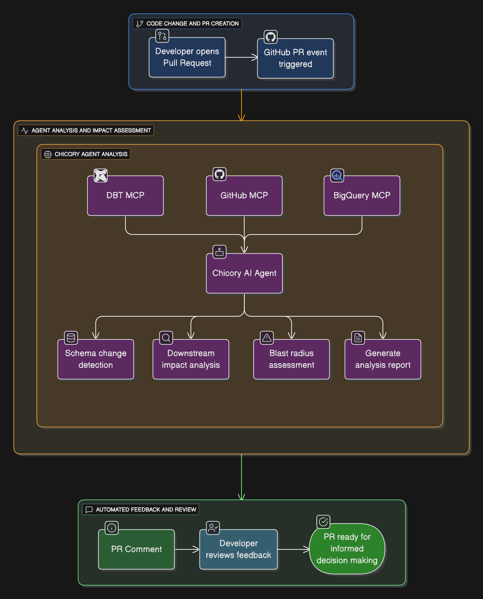

# Automated Schema Change Detection Cookbook

This cookbook demonstrates how to integrate **Chicory AI** with your data stack to proactively detect schema change in a PR, raised by a developer.

The agent is triggered on pull requests, analyzes the schema changes, it's downstream impacted radius with respect to the users/owners affected and adds a comment to the PR. 

---

## What You’ll Build
An agent that:
- Scans PR diffs to detect the schema change 
- Scans through DBT, Redash and other connected tools attached in order to detect the affected areas 
- Scans through Data Contracts, in order to analyze the affected user/owners
- Raises a PR comment, that includes an analysis and a blast radius 

---

## Contents

- [Introduction](docs/introduction.md) – Introduction to setup and tools
- [Agent Creation](docs/chicory-agent.md) – Create/Deploy your Chicory Schema Change Detection Agent
- [Github Action](docs/github-action.md) – GitHub Actions Workflow
- [Sample Comments](docs/sample-comments.md) – Example PR comment
- [Troubleshooting](docs/troubleshooting.md) – Common issues & fixes

---
