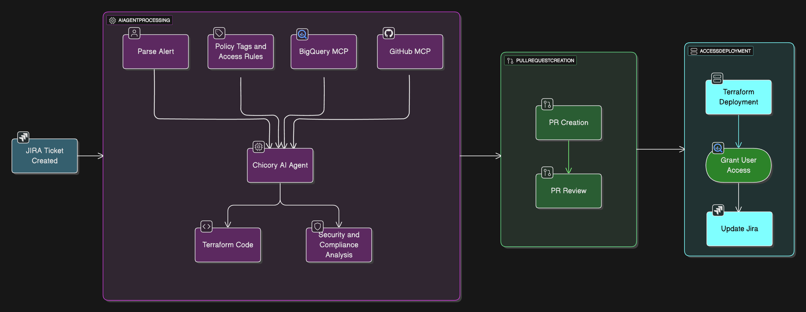

# Data Governance Access Automation Cookbook

This cookbook demonstrates how to integrate **Chicory AI** with your data stack to help automate the user access request approvals. The agent is triggered on a user access request ticket creation. This can be used with any data warehouse. 

---

## What You’ll Build

Raise a JIRA ticket that 
- Triggers a git action with the user access request information

Build an Agent that 
- Analyzes the policy tags and access rules that are set within an enterprise
- Provides an in detail analysis of whether the user must be approved to access a particular column/table
- Provides the terraform code to modify permissions in Bigquery

Build Git Actions that 
- Triggers on JIRA ticket creation, creates a PR with the agent analysis and code
- Triggers if the PR analysis and terraform code generated looks good to go (PR is merged). As a part of the action the JIRA ticket gets updated back with the final status. 
- Triggers if the PR analysis and terraform code generated is not justified enough (PR is closed) in order to update the JIRA ticket with the final status. 

---

## Contents

- [Introduction](docs/introduction.md) – Introduction to setup and flow
- [JIRA Ticket Creation](docs/jira-ticket-creation.md) - Create a new JIRA ticket
- [Build Taxonomy Policies](docs/build-taxonomy-policies.md) - Build/retrieve the data governance rules
- [Agent Creation](docs/chicory-agent.md) – Creating a Chicory Agent
- [GITHUB Actions workflow](docs/git-actions-workflow.md) - Trigger the agent and deploy permission changes (based on human approval) via Github actions. 
- [Sample Agent Response](docs/sample-agent-response.md) – Example Agent Response
- [Sample PR Analysis](docs/sample-PR-analysis.md) – Example PR Analysis
- [Troubleshooting](docs/troubleshooting.md) – Common issues & fixes

---
