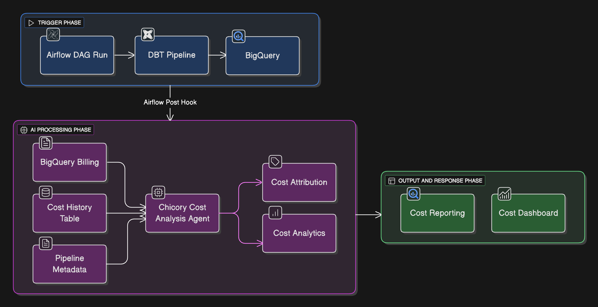

# Pipeline Cost Analysis Agent Cookbook

This cookbook demonstrates how to create, deploy, and integrate the **Pipeline Cost Analysis Agent** into a data engineering workflow.  

The agent attributes BigQuery query costs to dbt models and pipeline stages, aggregates costs at pipeline level, and stores them in a centralized BigQuery table for historical analysis and visualization.

---

## What You’ll Build
An agent that:
- Collects BigQuery job costs from billing exports
- Attributes costs to dbt models/stages
- Aggregates total per pipeline run
- Stores history in a BigQuery table
- Publishes results to a Redash dashboard

---

## Contents
1. [Introduction](./docs/introduction.md)
2. [BigQuery Billing Setup](./docs/bigquery-billing-setup.md)
3. [Agent Creation](./docs/chicory-agent.md)
4. [Airflow Post-hook](./docs/airflow-posthook.md)
5. [Run Pipeline + Dashboard](./docs/run-and-dashboard.md)
6. [Sample Analysis Report](./docs/sample-analysis.md)
7. [Troubleshooting](./docs/troubleshoot.md)

---
