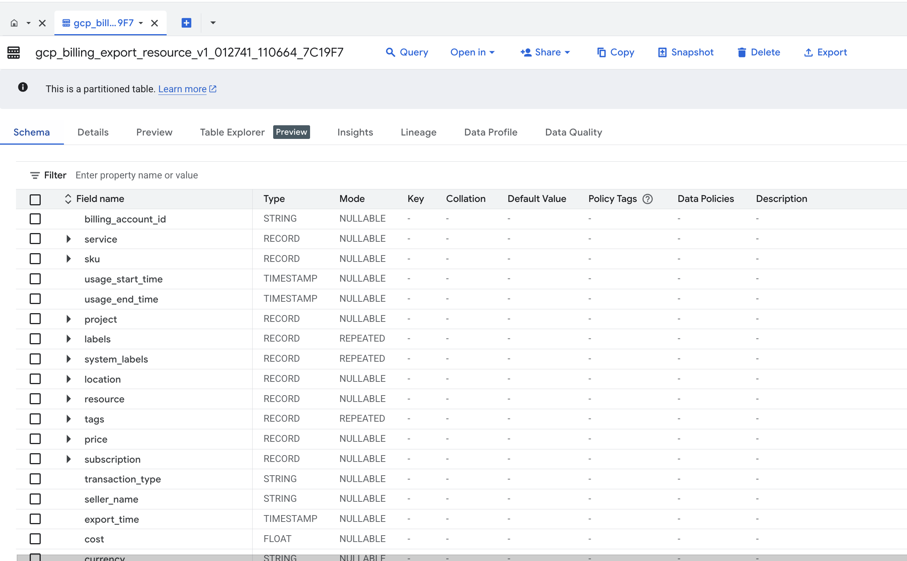

# BigQuery Billing Setup

1. **Enable Billing Export**
   - Go to **Billing → Billing Export** in GCP console
   - Export **Detailed usage cost data** to BigQuery
   - Choose dataset (e.g., `billing_dataset`, or `financial_data`)

   **Purpose**: This creates the foundation for cost tracking by automatically exporting all GCP billing data to BigQuery. The agent will query this data to retrieve actual costs for each pipeline run, enabling precise cost attribution to specific queries and pipeline stages.
  



2. **Create Cost History Table**

   **Purpose**: This table stores aggregated cost data for each pipeline run, organized by pipeline stage and individual queries. It serves as the centralized repository for historical cost trends, enabling dashboard visualization and cost optimization analysis over time.

```sql
CREATE TABLE IF NOT EXISTS analytics.pipeline_cost_history (
  pipeline_id STRING,   -- Identifies which pipeline (e.g., 'user_analytics_daily')
  run_id STRING,        -- Unique identifier for each pipeline execution
  stage STRING,         -- Pipeline stage (e.g., 'extract', 'transform', 'load')
  query_id STRING,      -- Individual BigQuery job ID for granular tracking
  cost FLOAT64,         -- Actual cost in USD for this query/stage
  timestamp TIMESTAMP   -- When the cost was incurred
);
```
3. **(Optional) Create View for Normalized Query Costs**

   **Purpose**: This view provides real-time cost calculation based on bytes processed, useful for immediate cost estimation before billing data is fully exported. The agent can use this for near real-time cost tracking and validation against actual billing data.

```sql
CREATE OR REPLACE VIEW analytics.query_costs AS
SELECT
  job_id,
  (total_bytes_processed / POW(1024,4)) * 5.0 AS cost, -- replace with current $/TB pricing
  end_time AS timestamp
FROM region-us.INFORMATION_SCHEMA.JOBS_BY_PROJECT;
```

   **Why Optional**: While billing export provides exact costs, this view offers immediate estimates. Use this for development/testing environments or when you need instant cost feedback during pipeline development.

## Alternative Approaches

### 1. Native BigQuery Cost Controls
Instead of manual billing export setup, consider these automated approaches:

- **BigQuery Reservations**: Use slot-based pricing for predictable costs
  - [BigQuery Reservations Documentation](https://cloud.google.com/bigquery/docs/reservations-tasks)
- **Query Cost Controls**: Set up custom cost tables with automatic population
  - [BigQuery Pricing Calculator](https://cloud.google.com/products/calculator)
- **BI Engine**: Accelerate dashboards with in-memory analytics
  - [BI Engine Documentation](https://cloud.google.com/bigquery/docs/bi-engine-intro)

### 2. Real-time Cost Tracking
For immediate cost visibility:

- **Cloud Monitoring**: Set up BigQuery cost alerts
  - [BigQuery Monitoring](https://cloud.google.com/bigquery/docs/monitoring)
- **Pub/Sub Cost Notifications**: Stream cost data as it occurs
  - [Cloud Billing Pub/Sub](https://cloud.google.com/billing/docs/how-to/budgets-programmatic-notifications)

### 3. Enhanced Cost Attribution
More granular cost tracking options:

- **Labels & Tags**: Automatic cost attribution by project/team
  - [BigQuery Job Labels](https://cloud.google.com/bigquery/docs/labels-intro)
- **Information Schema**: Real-time job cost queries
  - [Jobs by Project Schema](https://cloud.google.com/bigquery/docs/information-schema-jobs)

---
