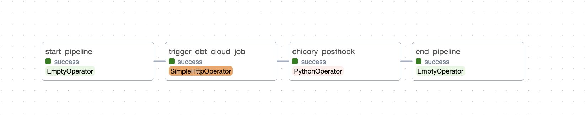
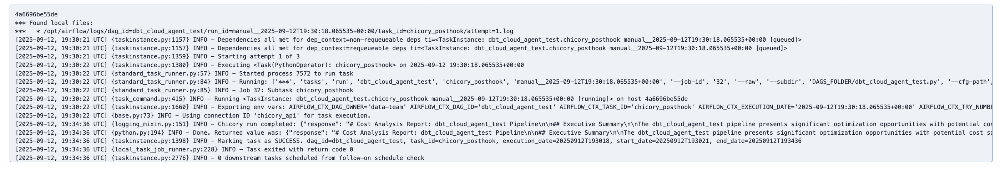
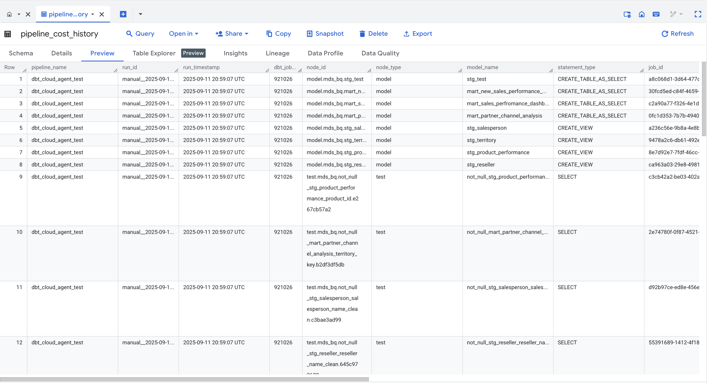
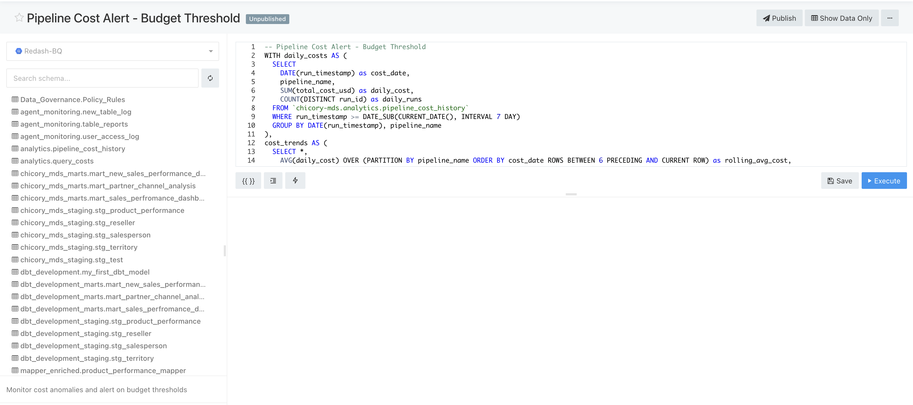
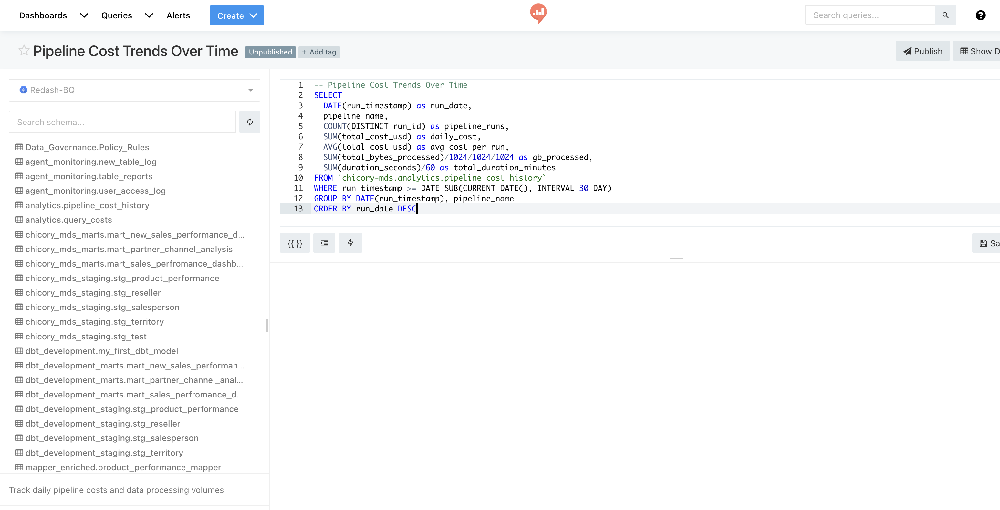
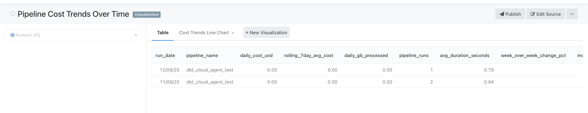
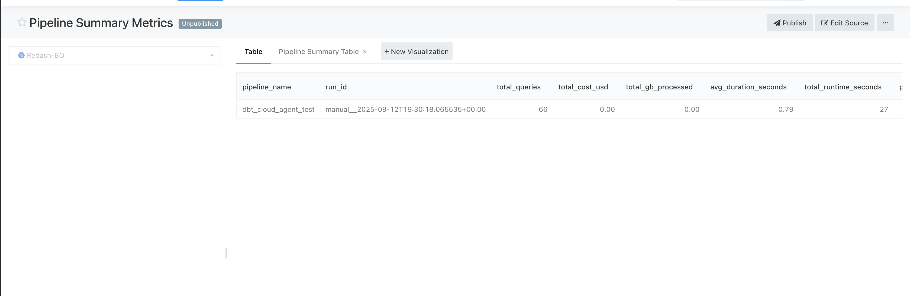
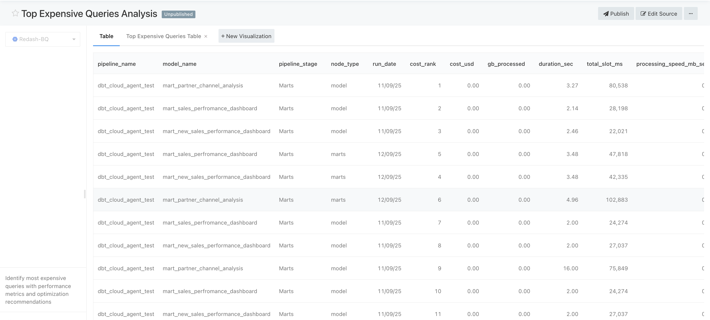

# Run Pipeline + Dashboard

1. **Trigger Airflow Pipeline**
   - Run the DAG from the Airflow UI or CLI
   - DAG completes dbt run → triggers cost analysis agent

2. **Agent Writes Cost Data**
   - Each run inserts rows into `analytics.pipeline_cost_history`

3. **Refresh / Create Redash Dashboard/Query**
   - If dashboard exists: agent calls Redash API to refresh
   - If not: agent creates a new dashboard

---
