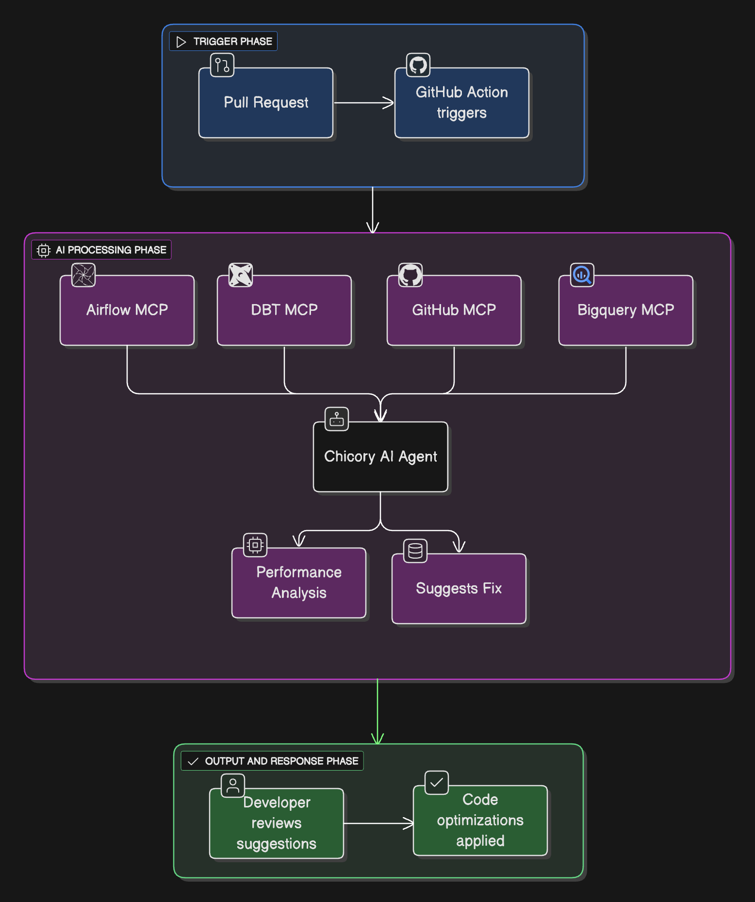

# Pipeline Performance & Efficiency Analysis Cookbook

This cookbook demonstrates how to integrate **Chicory AI** with your data stack to proactively catch inefficient code and keep pipelines fast and stable.

The agent is triggered on pull requests or when a pipeline slows down, scanning code changes and suggesting fixes before merge.

---

## What You’ll Build
An agent that:
- Scans PR diffs for inefficient code
- Predicts pipeline performance impact
- Suggests targeted fixes
- Posts automated comments on PRs

---

## Contents

- [Introduction](docs/introduction.md) – Introduction to setup and tools
- [Agent Creation](docs/chicory-agent.md) – Create/Deploy your Chicory Pipeline Analysis Agent
- [Github Action](docs/github-action.md) – GitHub Action template explained
- [Sample Comments](docs/sample-comments.md) – Example PR reviews
- [Troubleshooting](docs/troubleshooting.md) – Common issues & fixes

---
