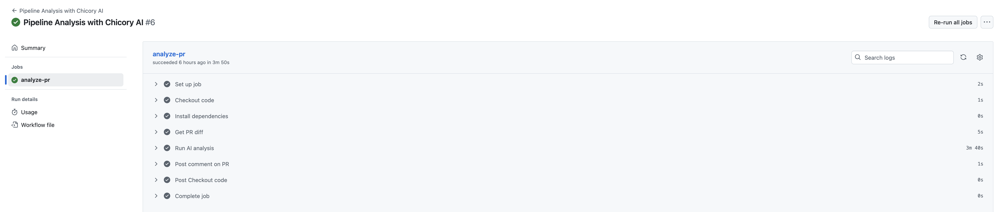

# GitHub Action Setup

This cookbook includes a ready-to-use workflow:  

    Github Action Workflow.


### How It Works
- Trigger: PR opened, synchronized, or manually dispatched
- Action:
  1. Fetches PR diff for `*.sql` files (configurable)
  2. Sends the diff to Chicory AI agent via REST API
  3. Waits for analysis result
  4. Posts feedback as a PR comment



### Agent Task
- Sample user prompt/context
```
Please review the PR diff with a focus on model and transformation efficiency.

Context:
- Airflow: use for DAG/orchestration structure and lineage insights
- dbt: use for pipeline and SQL transformation details
- GitHub: use for model code repository

Your task:
1. Scan the code changes and identify inefficient patterns.
2. Predict the performance impact of these changes before merge (e.g., runtime, scalability).
3. Pinpoint specific bottlenecks that could make the pipeline run slower.
4. Recommend targeted code improvements to fix the identified inefficiencies.
5. Provide detailed analysis for all models/queries, separately, in the proposed changes.

Note:
- Always use tools to fetch metrics.
- Leverage Airflow / dbt for run-time data, for comparative analysis. Mainly, past pipeline run times.
- Leverage Github context for query/pipeline (in-production) details.

```
