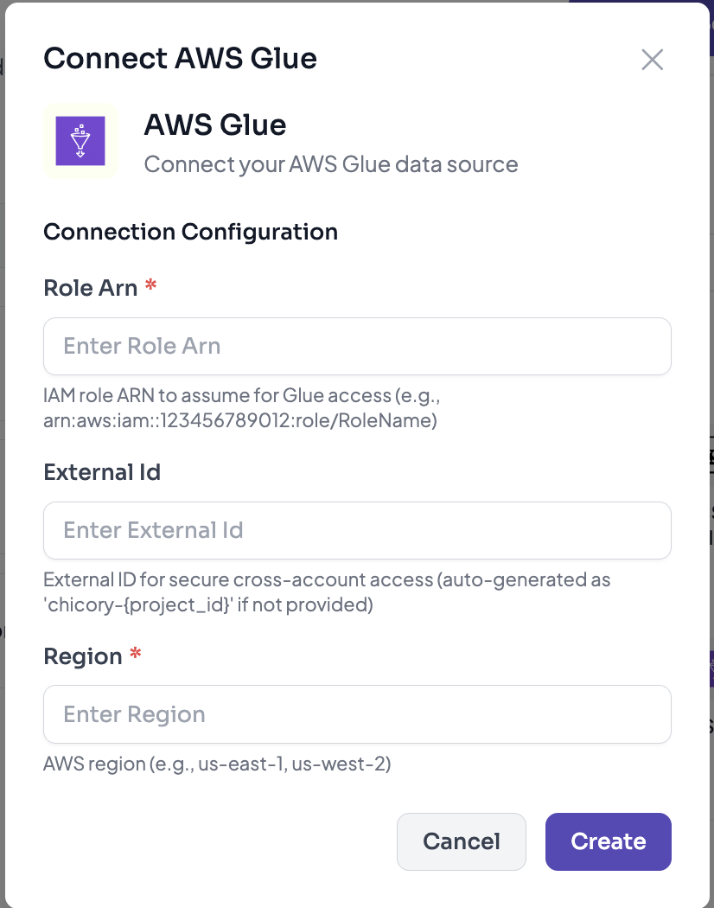

# AWS Integrations

Chicory provides comprehensive support for AWS services through secure cross-account access using IAM roles. This integration pattern ensures secure, auditable access to your AWS resources without sharing long-term credentials.

## Overview

All AWS integrations use the same authentication mechanism:
- **Authentication Method**: AWS IAM Role with Cross-Account Access
- **Security**: External ID for secure role assumption
- **Session Duration**: Temporary credentials (15-minute sessions)
- **Supported Services**: Glue Data Catalog, Athena, S3, DataZone
- **Access Levels**: ReadOnly (scanning & discovery) or ReadWrite (management, query execution & updates)

## Quick Start with CloudFormation

The fastest way to set up AWS integrations is using our CloudFormation template:

**CloudFormation Stack URL:**
```
https://console.aws.amazon.com/cloudformation/home?region=us-east-1#/stacks/create/review
?templateURL=https://chicory-public-templates.s3.us-west-2.amazonaws.com/chicory-glue-athena-crossaccount.yaml
&stackName=ChicoryGlueAccess
&param_ChicoryAccountId=<ask_the_team>
&param_ExternalId=chicory-<project_id>
&param_RoleName=GlueAccessRoleForChicory
&param_AccessLevel=ReadOnly
```

**Parameters to configure:**
- `ChicoryAccountId`: Contact Chicory team for this value
- `ExternalId`: Use `chicory-<your_project_id>` format
- `RoleName`: Choose a descriptive name (e.g., `GlueAccessRoleForChicory` or `DataZoneAccessRoleForChicory`)
- `AccessLevel`: Choose `ReadOnly` or `ReadWrite`

After creating the stack, copy the Role ARN from CloudFormation Outputs and use it to configure your Chicory connection.

For detailed step-by-step instructions, see the Setup Guide sections for [Glue](#setup-guide), [DataZone](#setup-guide-1), and [S3](#setup-guide-2).

## Authentication Setup

### Step 1: Create IAM Role in Your AWS Account

Create an IAM role in your AWS account that Chicory will assume to access your resources.

**Trust Policy** (allows Chicory to assume the role):

```json
{
  "Version": "2012-10-17",
  "Statement": [
    {
      "Effect": "Allow",
      "Principal": {
        "AWS": "arn:aws:iam::<CHICORY_VENDOR_ACCOUNT_ID>:root"
      },
      "Action": "sts:AssumeRole",
      "Condition": {
        "StringEquals": {
          "sts:ExternalId": "chicory-<your-project-uuid>"
        }
      }
    }
  ]
}
```

**Key Components:**
- `CHICORY_VENDOR_ACCOUNT_ID`: Chicory's AWS account ID (provided by Chicory)
- `chicory-<your-project-uuid>`: Unique external ID for your project (auto-generated or provided)

### Step 2: How Chicory Accesses Your Resources

```python
# Chicory assumes your IAM role
sts_client = boto3.client("sts")

assume_role_kwargs = {
    "RoleArn": role_arn,
    "RoleSessionName": "chicory-integration-session"
}

if external_id:
    assume_role_kwargs["ExternalId"] = external_id

resp = sts_client.assume_role(**assume_role_kwargs)
creds = resp["Credentials"]

# Use temporary credentials to access your AWS service
service_client = boto3.client(
    "glue",  # or "datazone"
    aws_access_key_id=creds["AccessKeyId"],
    aws_secret_access_key=creds["SecretAccessKey"],
    aws_session_token=creds["SessionToken"],
    region_name=region
)
```

---

## AWS Glue Data Catalog

AWS Glue Data Catalog provides a unified metadata repository for your data assets across AWS.



### Capabilities

**Scanning Support**: Yes
- Scans databases, tables, schemas, and partitions
- Extracts metadata including column names, types, and descriptions
- Supports table-level and partition-level metadata
- Accesses column statistics for data profiling
- Retrieves Athena query metadata and results

**MCP Tool Support**: Yes
- Query database and table information programmatically
- Search across catalog metadata
- Access schema definitions and lineage
- Execute Athena queries (ReadWrite mode)
- Manage data quality rulesets (ReadWrite mode)

### Use Cases

1. **Data Discovery**: Scan and catalog all tables in your Glue Data Catalog
2. **Schema Analysis**: Understand table structures and relationships
3. **Metadata Management**: Keep Chicory's catalog in sync with Glue
4. **Query Assistance**: Help users discover and query the right datasets
5. **Data Quality Monitoring**: Create and manage data quality rulesets to ensure data integrity (ReadWrite)
6. **Query Execution**: Execute Athena queries for data analysis and exploration (ReadWrite)
7. **Column Statistics**: Access and update column-level statistics for better query optimization

### Required Permissions

#### ReadOnly Access

Create an IAM policy with read-only access to Glue Data Catalog, Athena, and S3:

```json
{
  "Version": "2012-10-17",
  "Statement": [
    {
      "Sid": "GlueCatalogReadAccess",
      "Effect": "Allow",
      "Action": [
        "glue:GetDatabase",
        "glue:GetDatabases",
        "glue:GetTable",
        "glue:GetTables",
        "glue:GetPartition",
        "glue:GetPartitions",
        "glue:SearchTables",
        "glue:GetUserDefinedFunction",
        "glue:GetUserDefinedFunctions"
      ],
      "Resource": "*"
    },
    {
      "Sid": "AthenaQueryRead",
      "Effect": "Allow",
      "Action": [
        "athena:GetDataCatalog",
        "athena:ListDataCatalogs",
        "athena:GetWorkGroup",
        "athena:ListWorkGroups",
        "athena:GetQueryExecution",
        "athena:GetQueryResults",
        "athena:ListQueryExecutions",
        "athena:BatchGetQueryExecution"
      ],
      "Resource": "*"
    },
    {
      "Sid": "S3ReadAccess",
      "Effect": "Allow",
      "Action": [
        "s3:GetBucketLocation",
        "s3:GetObject",
        "s3:ListBucket"
      ],
      "Resource": "*"
    }
  ]
}
```

#### ReadWrite Access

For ReadWrite access, include additional write permissions for Glue Data Quality, Column Statistics, Athena query execution, and S3 write operations:

```json
{
  "Version": "2012-10-17",
  "Statement": [
    {
      "Sid": "GlueCatalogReadAccess",
      "Effect": "Allow",
      "Action": [
        "glue:GetDatabase",
        "glue:GetDatabases",
        "glue:GetTable",
        "glue:GetTables",
        "glue:GetPartition",
        "glue:GetPartitions",
        "glue:SearchTables",
        "glue:GetUserDefinedFunction",
        "glue:GetUserDefinedFunctions"
      ],
      "Resource": "*"
    },
    {
      "Sid": "GlueDataQualityAccess",
      "Effect": "Allow",
      "Action": [
        "glue:CreateDataQualityRuleset",
        "glue:GetDataQualityRuleset",
        "glue:UpdateDataQualityRuleset",
        "glue:DeleteDataQualityRuleset",
        "glue:ListDataQualityRulesets",
        "glue:StartDataQualityRuleRecommendationRun",
        "glue:GetDataQualityRuleRecommendationRun",
        "glue:StartDataQualityRulesetEvaluationRun",
        "glue:GetDataQualityRulesetEvaluationRun",
        "glue:ListDataQualityResults"
      ],
      "Resource": "*"
    },
    {
      "Sid": "GlueColumnStatisticsAccess",
      "Effect": "Allow",
      "Action": [
        "glue:GetColumnStatisticsForTable",
        "glue:GetColumnStatisticsForPartition",
        "glue:UpdateColumnStatisticsForTable",
        "glue:UpdateColumnStatisticsForPartition",
        "glue:DeleteColumnStatisticsForTable",
        "glue:DeleteColumnStatisticsForPartition"
      ],
      "Resource": "*"
    },
    {
      "Sid": "AthenaWorkGroupAccess",
      "Effect": "Allow",
      "Action": [
        "athena:CreateWorkGroup",
        "athena:GetWorkGroup",
        "athena:ListWorkGroups",
        "athena:UpdateWorkGroup",
        "athena:DeleteWorkGroup"
      ],
      "Resource": "*"
    },
    {
      "Sid": "AthenaDataCatalogAccess",
      "Effect": "Allow",
      "Action": [
        "athena:GetDataCatalog",
        "athena:ListDataCatalogs",
        "athena:UpdateDataCatalog"
      ],
      "Resource": "*"
    },
    {
      "Sid": "AthenaQueryAccess",
      "Effect": "Allow",
      "Action": [
        "athena:StartQueryExecution",
        "athena:GetQueryExecution",
        "athena:GetQueryResults",
        "athena:StopQueryExecution",
        "athena:ListQueryExecutions",
        "athena:BatchGetQueryExecution"
      ],
      "Resource": "*"
    },
    {
      "Sid": "S3AccessForAthenaResults",
      "Effect": "Allow",
      "Action": [
        "s3:GetBucketLocation",
        "s3:GetObject",
        "s3:ListBucket",
        "s3:PutObject"
      ],
      "Resource": "*"
    }
  ]
}
```

**Restrict to Specific Resources** (optional):

```json
"Resource": [
  "arn:aws:glue:<REGION>:<ACCOUNT_ID>:catalog",
  "arn:aws:glue:<REGION>:<ACCOUNT_ID>:database/*",
  "arn:aws:glue:<REGION>:<ACCOUNT_ID>:table/*/*"
]
```

### Connection Parameters

When connecting AWS Glue to Chicory:

| Parameter | Required | Description | Example |
|-----------|----------|-------------|---------|
| `role_arn` | Yes | IAM role ARN to assume | `arn:aws:iam::123456789012:role/ChicoryGlueAccess` |
| `external_id` | Yes | External ID for secure access | `chicory-proj-abc123` |
| `region` | No | AWS region (defaults to us-east-1) | `us-west-2` |

### Access Levels

Chicory supports two access levels for Glue integration:

| Access Level | Permissions | Use Cases |
|--------------|-------------|-----------|
| **ReadOnly** | Read-only access to Glue Data Catalog (GetDatabase, GetTables, SearchTables, etc.), Athena query metadata (GetQueryExecution, GetQueryResults), and S3 read access (GetObject, ListBucket) | Metadata scanning, data discovery, read-only catalog queries, query result access |
| **ReadWrite** | Read access + Glue Data Quality operations (Create/Update/Delete DataQualityRuleset), Column Statistics management, Athena query execution (StartQueryExecution, WorkGroup management), and S3 write access (PutObject for query results) | Metadata management, data quality monitoring, query execution, statistics updates, Athena workgroup management |

Choose the access level based on your integration requirements:
- Use **ReadOnly** for basic scanning, discovery, and reading query results
- Use **ReadWrite** if Chicory needs to execute queries, manage data quality rulesets, update column statistics, or write query results to S3

### Setup Guide

You can set up Glue integration using two methods:

#### Method 1: CloudFormation Template (Recommended)

The quickest way to set up Glue integration is using the CloudFormation template:

1. **Launch CloudFormation Stack**

   Click the link below to launch the stack (replace `<project_id>` with your Chicory project ID):

   ```
   https://console.aws.amazon.com/cloudformation/home?region=us-east-1#/stacks/create/review?templateURL=https://chicory-public-templates.s3.us-west-2.amazonaws.com/chicory-glue-athena-crossaccount.yaml&stackName=ChicoryGlueAccess&param_ChicoryAccountId=<ask_the_team>&param_ExternalId=chicory-<project_id>&param_RoleName=GlueAccessRoleForChicory&param_AccessLevel=ReadOnly
   ```
   [Try it](https://console.aws.amazon.com/cloudformation/home?region=us-east-1#/stacks/create/review?templateURL=https://chicory-public-templates.s3.us-west-2.amazonaws.com/chicory-glue-athena-crossaccount.yaml&stackName=ChicoryGlueAccess)

2. **Configure Stack Parameters**

   | Parameter | Description | Example |
   |-----------|-------------|---------|
   | `ChicoryAccountId` | Chicory's AWS account ID (contact Chicory team) | `123456789012` |
   | `ExternalId` | Your unique external ID | `chicory-<project_id>` |
   | `RoleName` | Name for the IAM role | `GlueAccessRoleForChicory` |
   | `AccessLevel` | Choose ReadOnly or ReadWrite | `ReadOnly` or `ReadWrite` |

3. **Review and Create**
   - Review the parameters
   - Acknowledge IAM resource creation
   - Click "Create stack"
   - Wait for stack creation to complete (status: CREATE_COMPLETE)

4. **Get Role ARN**
   - Go to CloudFormation Outputs tab
   - Copy the Role ARN value
   - Use this ARN when configuring Chicory

5. **Configure in Chicory**
   - Navigate to Integrations > AWS > Glue
   - Enter the IAM Role ARN from CloudFormation outputs
   - Enter External ID: `chicory-<project_id>`
   - Select AWS Region
   - Test connection

#### Method 2: Manual IAM Role Creation

If you prefer manual setup or need custom configurations:

1. **Create IAM Role**
   ```bash
   # Using AWS CLI
   aws iam create-role \
     --role-name ChicoryGlueAccess \
     --assume-role-policy-document file://trust-policy.json
   ```

2. **Attach Permissions Policy**
   ```bash
   # For ReadOnly access
   aws iam put-role-policy \
     --role-name ChicoryGlueAccess \
     --policy-name GlueReadOnlyAccess \
     --policy-document file://glue-readonly-permissions.json

   # For ReadWrite access, include additional write permissions
   aws iam put-role-policy \
     --role-name ChicoryGlueAccess \
     --policy-name GlueReadWriteAccess \
     --policy-document file://glue-readwrite-permissions.json
   ```

3. **Configure in Chicory**
   - Navigate to Integrations > AWS > Glue
   - Enter your IAM Role ARN
   - Enter External ID: `chicory-<project_id>`
   - Select AWS Region
   - Test connection

### What Gets Scanned

- **Databases**: All accessible Glue databases
- **Tables**: Metadata for all tables within databases
  - Table names and descriptions
  - Column names, types, and comments
  - Partition information
  - Storage location (S3 paths)
  - Creation/update timestamps
  - Column statistics (when available)
- **User-Defined Functions**: Custom functions registered in the catalog
- **Athena Resources**:
  - Data catalogs
  - WorkGroups
  - Query execution history and results (ReadOnly)
  - Query execution capabilities (ReadWrite)
- **S3 Access**:
  - Read access to data files referenced by Glue tables (ReadOnly)
  - Write access for Athena query results (ReadWrite)

### Limitations & Future Support

**Currently Supported:**
- Glue Data Catalog (scanning + MCP tools)

**Not Yet Supported:**
- AWS Glue Jobs (ETL pipelines) - planned
- AWS Glue Workflows (orchestration) - planned
- AWS Glue DataBrew (data preparation) - not on roadmap
- AWS Glue Studio (visual ETL) - not on roadmap
- AWS Glue Crawlers - not on roadmap

---

## AWS DataZone

AWS DataZone is a data management service that enables data discovery, cataloging, and governance across your organization.

### Capabilities

**Scanning Support**: Yes
- Scans domains, projects, environments, and data sources
- Extracts data assets and their metadata
- Indexes glossary terms and business metadata

**MCP Tool Support**: Yes
- Search across DataZone catalogs
- Query asset metadata and lineage
- Access data governance policies

### Use Cases

1. **Data Governance**: Discover and catalog governed data assets
2. **Business Context**: Access business metadata and glossary terms
3. **Data Discovery**: Help users find approved, governed datasets
4. **Access Management**: Understand data access patterns and permissions

### Access Levels

Chicory supports two access levels for DataZone integration:

| Access Level | Permissions | Use Cases |
|--------------|-------------|-----------|
| **ReadOnly** | Read-only access to DataZone resources (GetDomain, ListProjects, SearchListings, etc.) | Data discovery, metadata scanning, read-only catalog queries |
| **ReadWrite** | Read access + write operations (CreateAsset, UpdateAsset, DeleteAsset, CreateListing, etc.) | Asset management, publishing data products, managing listings |

Choose the access level based on your integration requirements:
- Use **ReadOnly** for discovery and scanning
- Use **ReadWrite** if Chicory needs to manage assets or publish data products

### Required Permissions

#### ReadOnly Access

Create an IAM policy with read-only access to DataZone:

```json
{
  "Version": "2012-10-17",
  "Statement": [
    {
      "Sid": "DataZoneReadAccess",
      "Effect": "Allow",
      "Action": [
        "datazone:GetDomain",
        "datazone:ListDomains",
        "datazone:GetProject",
        "datazone:ListProjects",
        "datazone:GetEnvironment",
        "datazone:ListEnvironments",
        "datazone:GetEnvironmentProfile",
        "datazone:ListEnvironmentProfiles",
        "datazone:GetDataSource",
        "datazone:ListDataSources",
        "datazone:GetAsset",
        "datazone:GetFormType",
        "datazone:GetListing",
        "datazone:SearchListings",
        "datazone:ListAssetRevisions",
        "datazone:GetGlossary",
        "datazone:GetGlossaryTerm"
      ],
      "Resource": "*"
    }
  ]
}
```

#### ReadWrite Access

For ReadWrite access, include additional write permissions:

```json
{
  "Version": "2012-10-17",
  "Statement": [
    {
      "Sid": "DataZoneReadAccess",
      "Effect": "Allow",
      "Action": [
        "datazone:GetDomain",
        "datazone:ListDomains",
        "datazone:GetProject",
        "datazone:ListProjects",
        "datazone:GetEnvironment",
        "datazone:ListEnvironments",
        "datazone:GetEnvironmentProfile",
        "datazone:ListEnvironmentProfiles",
        "datazone:GetDataSource",
        "datazone:ListDataSources",
        "datazone:GetAsset",
        "datazone:GetFormType",
        "datazone:GetListing",
        "datazone:SearchListings",
        "datazone:ListAssetRevisions",
        "datazone:GetGlossary",
        "datazone:GetGlossaryTerm"
      ],
      "Resource": "*"
    },
    {
      "Sid": "DataZoneWriteAccess",
      "Effect": "Allow",
      "Action": [
        "datazone:CreateAsset",
        "datazone:UpdateAsset",
        "datazone:DeleteAsset",
        "datazone:CreateListing",
        "datazone:UpdateListing",
        "datazone:DeleteListing",
        "datazone:CreateAssetRevision",
        "datazone:CreateDataSource",
        "datazone:UpdateDataSource",
        "datazone:DeleteDataSource"
      ],
      "Resource": "*"
    }
  ]
}
```

### Connection Parameters

When connecting AWS DataZone to Chicory:

| Parameter | Required | Description | Example |
|-----------|----------|-------------|---------|
| `role_arn` | Yes | IAM role ARN to assume | `arn:aws:iam::123456789012:role/ChicoryDataZoneAccess` |
| `external_id` | Yes | External ID for secure access | `chicory-proj-abc123` |
| `region` | No | AWS region (defaults to us-east-1) | `us-east-1` |

### Setup Guide

You can set up DataZone integration using two methods:

#### Method 1: CloudFormation Template (Recommended)

The quickest way to set up DataZone integration is using the CloudFormation template:

1. **Launch CloudFormation Stack**

   Click the link below to launch the stack (replace `<project_id>` with your Chicory project ID):

   ```
   https://console.aws.amazon.com/cloudformation/home?region=us-east-1#/stacks/create/review?templateURL=https://chicory-public-templates.s3.us-west-2.amazonaws.com/chicory-datazone-crossaccount.yaml&stackName=ChicoryDataZoneAccess&param_ChicoryAccountId=<ask_the_team>&param_ExternalId=chicory-<project_id>&param_RoleName=DataZoneAccessRoleForChicory&param_AccessLevel=ReadOnly
   ```
   [Try it](https://console.aws.amazon.com/cloudformation/home?region=us-east-1#/stacks/create/review?templateURL=https://chicory-public-templates.s3.us-west-2.amazonaws.com/chicory-datazone-crossaccount.yaml&stackName=ChicoryDataZoneAccess)

   > **Note**: The same CloudFormation template supports both Glue and DataZone integrations. The template creates appropriate IAM permissions based on the access level selected.

2. **Configure Stack Parameters**

   | Parameter | Description | Example |
   |-----------|-------------|---------|
   | `ChicoryAccountId` | Chicory's AWS account ID (contact Chicory team) | `123456789012` |
   | `ExternalId` | Your unique external ID | `chicory-<project_id>` |
   | `RoleName` | Name for the IAM role | `DataZoneAccessRoleForChicory` |
   | `AccessLevel` | Choose ReadOnly or ReadWrite | `ReadOnly` or `ReadWrite` |

3. **Review and Create**
   - Review the parameters
   - Acknowledge IAM resource creation
   - Click "Create stack"
   - Wait for stack creation to complete (status: CREATE_COMPLETE)

4. **Get Role ARN**
   - Go to CloudFormation Outputs tab
   - Copy the Role ARN value
   - Use this ARN when configuring Chicory

5. **Configure in Chicory**
   - Navigate to Integrations > AWS > DataZone
   - Enter the IAM Role ARN from CloudFormation outputs
   - Enter External ID: `chicory-<project_id>`
   - Select AWS Region
   - Test connection

#### Method 2: Manual IAM Role Creation

If you prefer manual setup or need custom configurations:

1. **Create IAM Role**
   ```bash
   aws iam create-role \
     --role-name ChicoryDataZoneAccess \
     --assume-role-policy-document file://trust-policy.json
   ```

2. **Attach Permissions Policy**
   ```bash
   # For ReadOnly access
   aws iam put-role-policy \
     --role-name ChicoryDataZoneAccess \
     --policy-name DataZoneReadOnlyAccess \
     --policy-document file://datazone-readonly-permissions.json

   # For ReadWrite access, include additional write permissions
   aws iam put-role-policy \
     --role-name ChicoryDataZoneAccess \
     --policy-name DataZoneReadWriteAccess \
     --policy-document file://datazone-readwrite-permissions.json
   ```

3. **Configure in Chicory**
   - Navigate to Integrations > AWS > DataZone
   - Enter your IAM Role ARN
   - Enter External ID: `chicory-<project_id>`
   - Select AWS Region
   - Test connection

### What Gets Scanned

- **Domains**: DataZone domains and their metadata
- **Projects**: Projects within domains
- **Data Sources**: Connected data sources and their configurations
- **Data Assets**: Published data assets with business metadata
- **Environment Profiles**: Environment configurations
- **Glossary**: Business glossary terms and definitions
- **Listings**: Published data product listings

---

## AWS S3

Amazon S3 (Simple Storage Service) provides object storage for data lakes, backups, and data archiving.

### Capabilities

**Scanning Support**: Yes
- Scans S3 buckets and their metadata
- Extracts object metadata (keys, sizes, timestamps)
- Supports bucket-level and object-level metadata
- Retrieves bucket configurations and policies

**MCP Tool Support**: Yes
- List and query S3 buckets and objects
- Access bucket metadata and configurations
- Read object content and metadata
- Upload and manage objects (ReadWrite mode)

### Use Cases

1. **Data Discovery**: Discover and catalog data stored in S3 buckets
2. **Data Lake Management**: Understand data lake structure and contents
3. **Data Governance**: Track data assets and their locations
4. **Data Migration**: Identify and catalog data for migration projects
5. **Data Quality**: Access and validate data stored in S3 (ReadWrite)
6. **Data Pipeline Support**: Read and write data for processing workflows (ReadWrite)

### Access Levels

Chicory supports two access levels for S3 integration:

| Access Level | Permissions | Use Cases |
|--------------|-------------|-----------|
| **ReadOnly** | Read-only access to S3 buckets (ListBucket, GetObject, GetBucketLocation, etc.) | Data discovery, metadata scanning, read-only data access |
| **ReadWrite** | Read access + write operations (PutObject, DeleteObject, CreateBucket, etc.) | Data management, data pipeline operations, data quality workflows |

Choose the access level based on your integration requirements:
- Use **ReadOnly** for discovery, scanning, and reading data
- Use **ReadWrite** if Chicory needs to write data, manage objects, or support data pipelines

### Required Permissions

#### ReadOnly Access

Create an IAM policy with read-only access to S3:

```json
{
  "Version": "2012-10-17",
  "Statement": [
    {
      "Sid": "S3BucketReadAccess",
      "Effect": "Allow",
      "Action": [
        "s3:ListBucket",
        "s3:GetBucketLocation",
        "s3:GetBucketVersioning",
        "s3:GetBucketTagging",
        "s3:GetBucketPolicy",
        "s3:ListAllMyBuckets"
      ],
      "Resource": "*"
    },
    {
      "Sid": "S3ObjectReadAccess",
      "Effect": "Allow",
      "Action": [
        "s3:GetObject",
        "s3:GetObjectVersion",
        "s3:GetObjectTagging"
      ],
      "Resource": "*"
    }
  ]
}
```

#### ReadWrite Access

For ReadWrite access, include additional write permissions:

```json
{
  "Version": "2012-10-17",
  "Statement": [
    {
      "Sid": "S3BucketReadAccess",
      "Effect": "Allow",
      "Action": [
        "s3:ListBucket",
        "s3:GetBucketLocation",
        "s3:GetBucketVersioning",
        "s3:GetBucketTagging",
        "s3:GetBucketPolicy",
        "s3:ListAllMyBuckets"
      ],
      "Resource": "*"
    },
    {
      "Sid": "S3ObjectReadAccess",
      "Effect": "Allow",
      "Action": [
        "s3:GetObject",
        "s3:GetObjectVersion",
        "s3:GetObjectTagging"
      ],
      "Resource": "*"
    },
    {
      "Sid": "S3WriteAccess",
      "Effect": "Allow",
      "Action": [
        "s3:PutObject",
        "s3:PutObjectTagging",
        "s3:DeleteObject",
        "s3:DeleteObjectVersion",
        "s3:CreateBucket",
        "s3:DeleteBucket",
        "s3:PutBucketTagging"
      ],
      "Resource": "*"
    }
  ]
}
```

**Restrict to Specific Resources** (optional):

```json
"Resource": [
  "arn:aws:s3:::my-bucket-name",
  "arn:aws:s3:::my-bucket-name/*"
]
```

### Connection Parameters

When connecting AWS S3 to Chicory:

| Parameter | Required | Description | Example |
|-----------|----------|-------------|---------|
| `role_arn` | Yes | IAM role ARN to assume | `arn:aws:iam::123456789012:role/ChicoryS3Access` |
| `external_id` | Yes | External ID for secure access | `chicory-proj-abc123` |
| `region` | No | AWS region (defaults to us-east-1) | `us-west-2` |

### Setup Guide

You can set up S3 integration using two methods:

#### Method 1: CloudFormation Template (Recommended)

The quickest way to set up S3 integration is using the CloudFormation template:

1. **Launch CloudFormation Stack**

   Click the link below to launch the stack (replace `<project_id>` with your Chicory project ID):

   ```
   https://console.aws.amazon.com/cloudformation/home?region=us-east-1#/stacks/create/review?templateURL=https://chicory-public-templates.s3.us-west-2.amazonaws.com/chicory-s3-crossaccount.yaml&stackName=ChicoryS3Access&param_ChicoryAccountId=<ask_the_team>&param_ExternalId=chicory-<project_id>&param_RoleName=S3AccessRoleForChicory&param_AccessLevel=ReadOnly
   ```
   [Try it](https://console.aws.amazon.com/cloudformation/home?region=us-east-1#/stacks/create/review?templateURL=https://chicory-public-templates.s3.us-west-2.amazonaws.com/chicory-s3-crossaccount.yaml&stackName=ChicoryS3Access)

2. **Configure Stack Parameters**

   | Parameter | Description | Example |
   |-----------|-------------|---------|
   | `ChicoryAccountId` | Chicory's AWS account ID (contact Chicory team) | `123456789012` |
   | `ExternalId` | Your unique external ID | `chicory-<project_id>` |
   | `RoleName` | Name for the IAM role | `S3AccessRoleForChicory` |
   | `AccessLevel` | Choose ReadOnly or ReadWrite | `ReadOnly` or `ReadWrite` |

3. **Review and Create**
   - Review the parameters
   - Acknowledge IAM resource creation
   - Click "Create stack"
   - Wait for stack creation to complete (status: CREATE_COMPLETE)

4. **Get Role ARN**
   - Go to CloudFormation Outputs tab
   - Copy the Role ARN value
   - Use this ARN when configuring Chicory

5. **Configure in Chicory**
   - Navigate to Integrations > AWS > S3
   - Enter the IAM Role ARN from CloudFormation outputs
   - Enter External ID: `chicory-<project_id>`
   - Select AWS Region
   - Test connection

#### Method 2: Manual IAM Role Creation

If you prefer manual setup or need custom configurations:

1. **Create IAM Role**
   ```bash
   # Using AWS CLI
   aws iam create-role \
     --role-name ChicoryS3Access \
     --assume-role-policy-document file://trust-policy.json
   ```

2. **Attach Permissions Policy**
   ```bash
   # For ReadOnly access
   aws iam put-role-policy \
     --role-name ChicoryS3Access \
     --policy-name S3ReadOnlyAccess \
     --policy-document file://s3-readonly-permissions.json

   # For ReadWrite access, include additional write permissions
   aws iam put-role-policy \
     --role-name ChicoryS3Access \
     --policy-name S3ReadWriteAccess \
     --policy-document file://s3-readwrite-permissions.json
   ```

3. **Configure in Chicory**
   - Navigate to Integrations > AWS > S3
   - Enter your IAM Role ARN
   - Enter External ID: `chicory-<project_id>`
   - Select AWS Region
   - Test connection

### What Gets Scanned

- **Buckets**: S3 bucket names, locations, and configurations
  - Bucket versioning status
  - Bucket tagging
  - Bucket policies
- **Objects**: Object keys, sizes, and metadata
  - Object timestamps (created, modified)
  - Object tags
  - Storage class information
  - Content type and encoding
- **Versions**: Object versions (if versioning is enabled)

---

## Security Best Practices

### External ID Usage

The External ID is a security feature that prevents the "confused deputy" problem:

1. **Unique per Project**: Each Chicory project gets a unique external ID
2. **Required Condition**: The trust policy requires matching external ID
3. **Format**: `chicory-<project-uuid>`
4. **Auto-Generation**: Chicory can auto-generate this when you connect

### Least Privilege Access

Follow the principle of least privilege:

1. **Read-Only Access**: Grant only read permissions for scanning
2. **Resource Restrictions**: Limit access to specific databases/catalogs
3. **Regional Restrictions**: Restrict to specific AWS regions if needed
4. **Time-Bound Sessions**: Temporary credentials expire after 15 minutes

### Monitoring and Auditing

Monitor Chicory's access to your AWS resources:

```bash
# CloudTrail logs will show AssumeRole events
aws cloudtrail lookup-events \
  --lookup-attributes AttributeKey=EventName,AttributeValue=AssumeRole \
  --max-items 10
```

**What to Monitor:**
- `AssumeRole` events with your role ARN
- API calls made by the assumed role session
- Failed authentication attempts

---

## Troubleshooting

### Connection Failures

**Error: "Access Denied"**
- Verify the IAM role trust policy includes Chicory's account ID
- Confirm the external ID matches
- Check that permissions policy is attached to the role

**Error: "Role not found"**
- Verify the role ARN format: `arn:aws:iam::{account}:role/{name}`
- Confirm the role exists in the correct AWS account
- Check for typos in the role name

**Error: "Invalid credentials"**
- Check that Chicory's AWS account credentials are properly configured
- Verify network connectivity to AWS STS endpoint

### Validation

Test the connection manually:

```bash
# Test assuming the role
aws sts assume-role \
  --role-arn arn:aws:iam::123456789012:role/ChicoryGlueAccess \
  --role-session-name test-session \
  --external-id chicory-your-project-id

# Test Glue access with assumed credentials
export AWS_ACCESS_KEY_ID=<from assume-role output>
export AWS_SECRET_ACCESS_KEY=<from assume-role output>
export AWS_SESSION_TOKEN=<from assume-role output>

aws glue get-databases --region us-east-1
```

---

## Additional Resources

- [AWS IAM Roles Documentation](https://docs.aws.amazon.com/IAM/latest/UserGuide/id_roles.html)
- [AWS Glue Data Catalog API](https://docs.aws.amazon.com/glue/latest/dg/aws-glue-api-catalog.html)
- [AWS DataZone Documentation](https://docs.aws.amazon.com/datazone/)
- [AWS STS AssumeRole](https://docs.aws.amazon.com/STS/latest/APIReference/API_AssumeRole.html)

---

## Support

For assistance with AWS integrations:
- Contact Chicory support with your IAM role ARN and external ID
- Include CloudTrail logs if experiencing authentication issues
- Provide error messages from the Chicory UI
